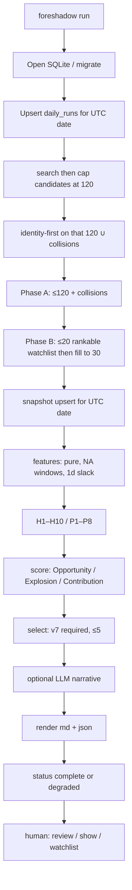
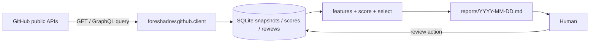
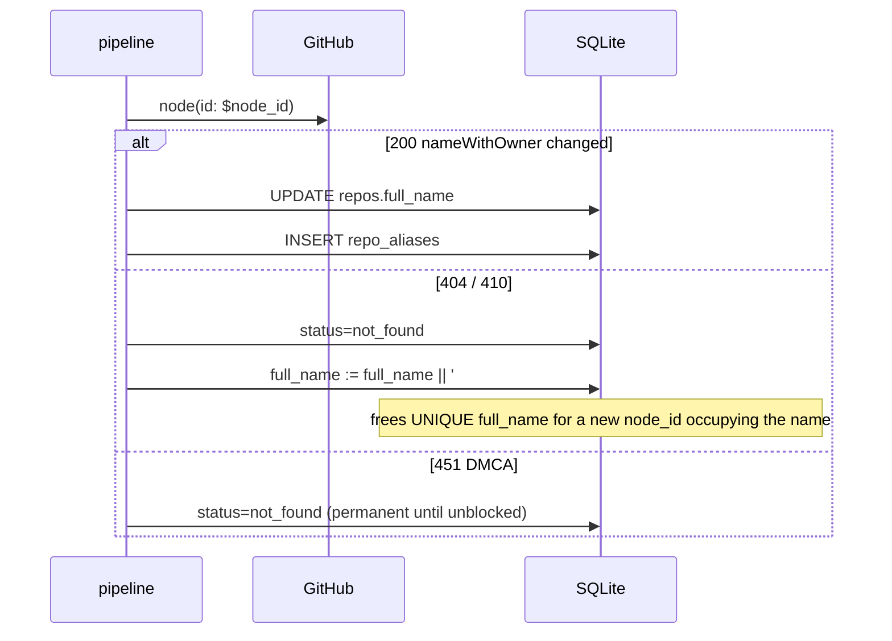

# Foreshadow (伏笔) — P0 Architecture & Technical Specification

| Field | Value |
|---|---|
| **Document** | P0 Architecture & Technical Specification |
| **Product** | Foreshadow (伏笔) — local, single-user, daily GitHub OSS Opportunity Radar |
| **Intended GitHub** | `rainhuang0220/foreshadow` |
| **Tagline** | Find what the future has already foreshadowed. |
| **Author** | TBD (owner: `rainhuang0220`) |
| **Date** | 2026-08-24 |
| **Status** | **Accepted** (owner approved defaults + language lock, 2026-08-24) |
| **Audience** | Senior engineers implementing P0 |
| **Scoring lock** | `research-metrics.md` (do not invent a second system) |
| **Architecture lock** | `research-architecture.md` (stack, pipeline shape, CLI, tests) with documented divergences in [§ Key Decisions](#key-decisions) |

---

## Overview

Foreshadow is a **local CLI** that, at most once per UTC day, discovers a shortlist of emerging public GitHub repositories, hydrates them with **GET-only** GitHub APIs, writes a **daily snapshot** of star/fork/issue counts, computes three explainable scores (**Opportunity / Explosion / Contribution**, each /100), and emits a markdown report containing **at most five** cards. The human then records Watch / Interested / Reject / Investigate / Enter / Later. Empty Top 5 is a successful outcome.

This is not a GitHub searcher, not a trending scraper, not a contribution-farming bot, and not a SaaS. GitHub does not expose third-party star history (stargazer listing is admin/collaborator-only as of 2026-06-30). **Our daily snapshots are the star-history series.** Scores never use commit count as a KPI. The client never calls GitHub write APIs. An optional LLM may write narrative after ranking; it **cannot** change numbers.

P0 is successful when a user with `GITHUB_TOKEN` can run `foreshadow run`, read a markdown Top 5 (or an honest empty list) with component breakdowns, evidence, confidence, and risks; record a review; re-run the same UTC date without duplicating reviews; and CI proves the failure cases in [§ Test Strategy](#test-strategy) without talking to `api.github.com`.

---

## Background & Motivation

The owner wants three outcomes: real engineering skill, genuine OSS reputation, and higher odds of being early in high-potential projects. That is the opposite of optimizing greens on a contribution graph.

Public GitHub data in 2026 makes a naïve “trending + star velocity” product **incorrect**:

- There is **no** `starHistory` on the repository object.
- Listing stargazers (`starred_at`) is restricted to admins/collaborators (changelog 2026-06-30). star-history.com charts for foreign repos are broken.
- GH Archive `WatchEvent` is degraded (star events largely disappeared 2025–2026). It is not a P0 launch dependency.
- REST `open_issues_count` **includes pull requests**. REST `watchers_count` is an **alias of stars**; true watchers are `subscribers_count`.
- REST contributors link only the first **500** author emails; `C >= 500` is censored, not “Linux has 500 contributors.”
- `/stats/contributors` is unreliable (async 202; 2026 regression reports of 202-forever). Traffic clones/views are owner-only. Dependents have no official API.

Without local snapshots, “acceleration” is a hallucination. Without hard fake-opportunity filters, AI-wrapper star spikes drown the list. Without a hard cap of five (and permission to emit zero), the product becomes another noisy aggregator.

Foreshadow exists to read the **伏笔 already in the data** — acceleration, real users, a contributor gap, a problem the user can actually fix, and identity that is still available — and then **stop**, so a human decides.

---

## Goals & Non-Goals

### P0 goals

1. Discover ≲120 unique public GitHub repos/day via 8–15 Search queries **including** watchlist (watchlist is not extra).
2. Hydrate, snapshot, score, and select **≤5** (prefer 0–2 over padding). **Top 5 requires a defined `v7`** (Momentum confidence ≥ medium). Day-1 Top 5 is empty by construction.
3. Persist component scores, evidence, timestamps, confidence; missing windows are `NA`, not `0`.
4. Write `reports/YYYY-MM-DD.md` in the product-brief card format.
5. Persist human reviews; on **Enter**, snapshot `stars_at_entry` / `contributors_at_entry` / scores.
6. Ship a real OSS repo skeleton (README, MIT, CI, changelog, example report) without feature-padding.
7. Tests for every required failure case; default tests never open a socket.

### P0 non-goals (kill list)

- Any GitHub write: issues, PRs, comments, reviews, stars, forks, gists, notifications.
- Dashboard, SPA, local HTTP UI, TUI, Slack/email/webhooks.
- Multi-user, cloud, SaaS, sync, accounts.
- Reddit / HN / X / Hugging Face / npm / PyPI / crates.io ingest.
- Scraping `github.com/trending` or unofficial trending APIs.
- GH Archive / ClickHouse / OSSInsight clones as a launch blocker.
- Stargazer listing / `starred_at` reconstruction.
- `/stats/*` on the critical path; `/traffic/*`; dependents scrape.
- Cloning every candidate; full issue census; ML ranker; embeddings.
- Padding Top 5; treating stars as users; commit-count KPIs.
- LLM as a numeric judge.

### Later (do not design here)

| Phase | One-line scope |
|---|---|
| **P1** | Multi-source ingest, GH Archive backfill of `v7` for newly seen names, maintainer first-response time, user starred-repos as seeds, `gh` extension, Windows CI |
| **P2** | Contribution-opportunity generation that may clone **entered** repos, issue clustering with LLM, local PR draft (still human-submit) |
| **P3** | Personalized ranking, ecosystem graphs, portfolio analytics (“how many Enter decisions 10×d?”) |

---

## Hard Invariants

The design is **invalid** if any of these are violated.

1. Never optimize commit count / PR count / contribution-graph greens as KPIs. Unique committers are a **denominator**, not a score.
2. **Never** auto-submit issues, PRs, commits, comments, or reviews to third-party repos. P0: **no GitHub write APIs at all** (no REST POST/PUT/PATCH/DELETE; no GraphQL `mutation`).
3. Daily final output is **at most 5** projects. Prefer 0–2 over padding. Empty Top 5 is a valid success.
4. Scores are fully explainable: persist component scores + evidence + timestamps + confidence. Missing windows **and missing Phase-B fields** are `NA`, not `0`.
5. Human is the last decision maker. Actions: Watch, Interested, Reject, Investigate, Enter, Later. Persist them.
6. Do not claim a project “will explode”. Use Potential / Probability / Confidence / Evidence / Risk.
7. Direction fit is **not** a hard gate. Exceptional Opportunity override exists (~60% fit + outstanding other scores).
8. Snapshot-first growth. Do not list stargazers for third-party velocity.
9. P0 is GitHub-only. If a source is missing, degrade, do not crash.
10. Smallest correct P0. Not a SaaS, not a dashboard, not ML, not auto-PR.

### GitHub field traps (implementer checklist)

| Trap | Wrong | Right |
|---|---|---|
| REST `open_issues_count` | “open issues” | Issues **plus** PRs. Always use GraphQL `issues(states:OPEN).totalCount` and `pullRequests(states:OPEN).totalCount` separately. |
| REST `watchers` / `watchers_count` | “watchers” | Alias of stars (2012 leftover). True watchers = `subscribers_count`. **P0 does not query** GraphQL `watchers` (restricted listing surface, unused in scores) or REST `/subscribers`. `snapshots.watchers` stays NULL. |
| `updated_at` | “last commit” | Includes stars, issues, wiki. Use `pushed_at` + default-branch `committedDate`. |
| `mentionableUsers.totalCount` | “contributors” | People who can be @-mentioned. Not commit authors. |
| REST contributors `C==500` | exact census | Censored lower bound. |
| `fork:false` in search | official qualifier | **Not documented.** Forks are excluded by default. Do not send `fork:false`. |

---

## Key Decisions

| # | Decision | Rationale |
|---|---|---|
| K1 | **Python 3.12**, `uv`, `pyproject.toml`, CLI `foreshadow`, import `foreshadow`, PyPI `foreshadow-radar`. **No Go in P0. No dual-language parallel implementation.** | Scoring, historical analysis, optional LLM HTTP, and pytest are the product core — speed, explainability, iteration. Go is **not** a second P0 implementation. Retain Go only as a *future* single-binary CLI / distribution migration (schema/pipeline/scores stay portable). Dual-stack in P0 is forbidden. |
| K2 | **Scoring lock = metrics research**, 0–100, weights 20/15/15/20/15/10/5 | Product brief and metrics spec are the Opportunity formula. Architecture research §3.1 described a *different* 0–1 Opportunity/Explosion/Contribution blend (`combined = 0.40/0.30/0.30`). **Rejected** — that would be a second scoring system. |
| K3 | **SQLite** in platformdirs; **`node_id` is PK**; `full_name` mutable | Need idempotent re-run, rename, 7-day velocity SQL, review history. JSON files corrupt; Postgres is a SaaS seed. |
| K4 | **GraphQL-first GET-only client** (`httpx`); REST for contributors, commits, contents, workflows, community profile, ETag leftovers | Architecture lock. GraphQL splits issues vs PRs. REST search is **fallback only** (30/min bucket). No PyGithub. Sequential HTTP (async is a secondary-limit footgun). |
| K5 | **Our snapshots are star history** | Stargazer listing 403 for third parties; GH Archive WatchEvent degraded. Day 1–7 degrade confidence; never impute missing `v7` as 0 or as lifetime rate. |
| K6 | **Two-phase hydrate with ordered caps**: **Cap candidates at 120 first** (watchlist truncated, then search fill). Then identity-first on **that 120** plus collision partners. Phase A ≤ **120 + \|collisions\|**. Phase B = 30 with **≤20 reserved for rankable watchlist**. **`enter` is Phase A only**. Do not hydrate names the cap dropped. Not every historical `node_id`. | Unbounded watchlist or untruncated search identity hydrates exceed 800/400. Collision partners are extra `HydrateANode` calls (suffix the old row), not a full-table crawl. |
| K7 | **H1–H10; P1–P8; Top 5 iff Opportunity ≥ 55 AND Explosion ≥ 35 AND `v7` defined (Momentum confidence ≥ medium)** | Metrics §10 over §4.3. Lifetime `S/age` Explosion proxy is **evidence/watchlist only** and **must not** satisfy the 35 gate. Day-1 Top 5 is empty. |
| K8 | **Direction fit is scored, not a gate**; exceptional override as metrics §5.3 | Product rule: ~60% fit + outstanding other five can still enter Top 5, labeled. |
| K9 | **Reviews are eligibility filters, not ranking nudges** | Architecture proposed `interested +0.03` / `investigate +0.05`. Dropped so Opportunity stays a pure function of GitHub evidence + config. Human taste is expressed by Watch/Reject/Enter, not ghost points. |
| K10 | **LLM off by default; narrative only** | Cannot change scores, vetoes, or rank. Tests pass with LLM raising. |
| K11 | **UTC calendar dates**; snapshot identity = `(node_id, YYYY-MM-DD)` | Reproducible runs beat laptop local time. Report header may also print local time. |
| K12 | **Token: `GITHUB_TOKEN` then `GH_TOKEN` then `gh auth token`** | Classic PAT with **no scopes**, or fine-grained public metadata read. Never in TOML/SQLite/logs. Unauthenticated 60/h is not a supported mode. |
| K13 | **MIT, no telemetry, DB mode 0600** | Matches `whereToken`. Local-first. |
| K14 | **REST budget 400 / GraphQL 800 points per run** (stop discover when remaining < 80) | Architecture’s 100 REST is too tight once Phase B does contributors+commits+contents+workflows on ~30 repos. Documented divergence. |
| K15 | **Do not send `fork:false`** | Not an official search qualifier (API research). Discovery may drop forks when `exclude_forks=true`. **H2 always vetoes forks from Top 5** regardless of that key. |
| K16 | **GraphQL `search(type: REPOSITORY)` is primary; REST search is fallback only** | Architecture lock (avoid the 30/min REST search bucket). Diverges from API research §9 “REST Search only.” Same 1,000-result cap; put sort qualifiers in the query string, not a GraphQL `sort` argument. Engine 2.0 Discovery: `sort:updated` only; **never** `sort:stars`. |
| K17 | **Fake growth = H1–H10 + P1–P8**, not architecture `fake_growth` vetoes | Metrics is the scoring lock. Architecture’s `Δ1d≥50 ∧ 0 commits` is covered when `S(t-1)` exists by **P8** (penalty, not silent Top 5). A 100-day-old bought-star dump with users/issues can still pass — empty Top 5 and H4/P1 remain the defense. |
| K18 | **Contributor pagination stops early** | Stop at a short page, or 500 identified (`C_censored`), or `C≥80` (starved and `late()` already decided). Do not always take 5 pages. |

---

## Proposed Design

### System shape

One process, one SQLite writer, sequential HTTP, no daemon, no in-process cron. Document a crontab/`launchd` one-liner in the README.

```
foreshadow run    → discover → hydrate → snapshot → features → score → select → render
foreshadow review → append-only human decision (Enter also writes entries)
```

Data lives under `FORESHADOW_HOME` (default platformdirs user data dir):

| OS | Default |
|---|---|
| macOS | `~/Library/Application Support/foreshadow/` |
| Linux | `~/.local/share/foreshadow/` |
| Tests | temp dir via `FORESHADOW_HOME` |

```
$FORESHADOW_HOME/
  foreshadow.sqlite3          # mode 0600
  reports/YYYY-MM-DD.md
  reports/YYYY-MM-DD.json     # machine-readable sibling for tests
  cache/http/                 # optional large bodies
```

Config: `~/.config/foreshadow/config.toml` (XDG) and optional `./foreshadow.toml`. **Never** store the GitHub token there.

### Directory layout (implementation will create)

Small OSS repo, not a platform monorepo. No `docs/` wiki, Docker, Helm, plugin loader, or dashboard.

```
foreshadow/
  README.md
  README.zh-CN.md                 # short; English README is source of truth
  LICENSE                         # MIT
  CHANGELOG.md                    # Keep-a-Changelog, starts at 0.1.0
  CONTRIBUTING.md                 # short: tests, ruff, no live GitHub in CI
  pyproject.toml
  uv.lock
  .python-version                 # 3.12
  .gitignore                      # .env, .venv, dist/, data/, reports/, *.sqlite3
  .github/workflows/ci.yml        # ruff + pytest; pin action SHAs; contents:read
  .github/ISSUE_TEMPLATE/bug.yml
  .github/PULL_REQUEST_TEMPLATE.md
  src/foreshadow/
    __init__.py                   # __version__
    __main__.py
    cli.py                        # typer: run, report, show, review, watchlist
    config.py                     # TOML + pydantic v2
    paths.py                      # FORESHADOW_HOME / platformdirs
    db.py                         # connect, migrate, pragmas
    models.py                     # pydantic DTOs
    clock.py                      # injectable now= UTC
    directions.toml               # packaged direction bags
    sql/
      001_init.sql                # schema version 1; importlib.resources
    github/
      __init__.py
      client.py                   # GET + GraphQL query only; budget; backoff
      queries.py                  # GraphQL document strings
      cache.py                    # sha256(query+vars) same-day
      rest.py                     # contributors, commits, contents, workflows, community
    pipeline/
      __init__.py
      discover.py
      hydrate.py
      snapshot.py
      features.py                 # pure
      h_rules.py                  # pure H1–H10 / P1–P8
      direction.py                # pure keyword/topic/language
      score.py                    # pure
      select.py                   # pure
      report.py                   # markdown + JSON, pure given DTOs
    reviews.py                    # append-only + Enter snapshot
    llm.py                        # optional narrative; default off
  tests/
    conftest.py                   # tmp FORESHADOW_HOME, fake clock
    test_score.py
    test_select.py
    test_features.py
    test_h_rules.py
    test_direction.py
    test_worked_examples.py       # metrics §12.A/B/C — required
    test_cold_start.py
    test_exceptional.py
    test_discover_merge.py
    test_idempotency.py
    test_rename.py
    test_github_errors.py
    test_hydrate.py               # open_issues_count / watchers_count traps
    test_client_get_only.py
    test_db.py                    # schema, uniqueness, packaging
    test_report.py
    test_review.py
    test_watchlist.py
    test_pre_rank.py
    test_budget_caps.py
    test_llm_does_not_score.py    # LLM is after select; not in test_score.py
    fixtures/graphql/
    fixtures/rest/
    fixtures/repos/               # memkit.json, giant.json, wrapper.json, organic_spike.json
  examples/
    config.toml
    report-sample.md              # golden; generated from fixtures
    report-sample-empty.md        # “no Top 5 today”
```

SQL lives at **`src/foreshadow/sql/001_init.sql`** and is loaded with `importlib.resources` so `uvx foreshadow-radar` still migrates. `directions.toml` is package data next to `config.py`. Hatchling must include `foreshadow/sql` and `foreshadow/directions.toml`.

P0 README **must** say: empty Top 5 is OK; **Top 5 requires ~7 daily snapshots (`v7`)**; day 1 is empty by construction; lifetime `stars/age` is not Explosion; token stays on the machine; we only GET public GitHub; this is not trending.

State files `PROJECT_STATE.md`, `ROADMAP.md`, `DECISIONS.md`, `TODO.md` are owner process files. Create them in the first skeleton PR as **honest** “P0 not yet implemented” pages — not as a fake wiki. They are not a product surface.

### Stack (locked)

| Layer | Choice |
|---|---|
| Language | **Python 3.12** (`requires-python >=3.12`; CI: 3.12 and 3.13). No Go in P0. |
| Packaging | `uv` + hatchling; `requires-python = ">=3.12"` |
| Runtime | `httpx`, `pydantic>=2`, `typer`, `platformdirs` |
| Stdlib | `sqlite3`, `tomllib`, `json`, `hashlib`, `datetime` (UTC) |
| Dev | `pytest`, `ruff`, `respx` |
| **Forbidden** | PyGithub, pandas, numpy, SQLAlchemy, asyncio, TUI, official LLM SDKs in P0 |

Lint: `ruff check` + `ruff format --check`. Lockfile `uv.lock` committed.

### Pipeline





### Stage contracts

One UTC date = one `daily_runs` row (`run_date` UNIQUE). `--force` reuses that row; it does **not** insert a second run.

**When `--force` is required**

| Today’s `daily_runs.status` | `foreshadow run` |
|---|---|
| no row / `failed` / `running` (crash leftover) / `degraded` | Re-run **without** `--force`. `ON CONFLICT` sets `status='running'` and replaces candidates/scores/failures. |
| `complete` | Print report path and exit 0 unless `--force`. |

`--force` **bypasses the GraphQL same-day cache** (cache key gets a `force` nonce, or the cache is skipped). REST `If-None-Match` / 304 is **kept** (quota-correct; 304 is a real “unchanged”).

**Idempotent re-run of today:**

| Keep | Replace |
|---|---|
| All `reviews` and `entries` history | `candidates`, `scores`, `source_failures` for this `run_id` |
| `repos` identity + aliases | `repos` mutable fields (name, description, flags) |
| Older `snapshots` | Today’s snapshot row (`UNIQUE(repo_id, snapshot_date)` upsert) |
| Older reports | `reports/YYYY-MM-DD.md` and `.json` overwritten |

Algorithm (`src/foreshadow/pipeline/__init__.py` `run_pipeline(now=, force=)`):

1. Open DB, apply migrations, `PRAGMA foreign_keys=ON`, WAL, `busy_timeout=5000`.
2. `INSERT INTO daily_runs(run_date, …) … ON CONFLICT(run_date) DO UPDATE status='running'`. Capture `run_id`. Recover `running` like `failed`.
3. `DELETE FROM candidates, scores, source_failures WHERE run_id=?`.
4. **Search, cap candidates at 120, then identity-first** (bounded — **not** every historical `node_id`, **not** the untruncated watchlist or raw search union). See [Identity apply-order](#identity-rename-delete-name-reuse):
   1. Run the 12 search queries; collect hit `full_name`s and `node_id`s. Do not INSERT yet.
   2. **Cap first:** `candidates` = watchlist_ids (newest first, truncate to 120 → `watchlist_truncated`) then fill from search hits to 120 (`search_capped` if leftovers). Do **not** hydrate names the cap dropped.
   3. `identity_ids = { known node_ids already in that 120 } ∪ { active repos whose full_name matches a candidate in that 120 }` (collision partners).
   4. `HydrateANode` those IDs only (rename/delete/collision). Collision partners may add extra calls: **Phase A ≤ 120 + |collisions|**.
   5. Then INSERT new search hits that are in the 120 (suffix+insert in one transaction on collision).
5. Phase A remainder for anyone in the 120 not yet fetched → Phase B shortlist → snapshot → features → score → select → render.
6. Set `status` to `complete` or `degraded` using the **single** predicate below. Write `report_path`.
7. On crash: `failed` + `error` if we can write; otherwise the row stays `running` and the next `run` recovers it. Reviews untouched.

`--date YYYY-MM-DD` is **test-only** (injected clock). Production uses `datetime.now(UTC).date()`. Metrics’ “00:05 UTC” is a **target** for humans who cron the CLI, not a server the process enforces.

**`complete` vs `degraded` (one predicate, copied in Observability and tests):**

```
degraded iff search_truncated OR budget_abort OR hydrate_failed > 0 OR watchlist_truncated
```

`search_capped` (we dropped leftover search hits because the 120 cap is working) is **not** degraded — record it in `source_health` only. Hitting our own cap is success; GraphQL `repositoryCount > first` (`search_truncated`) is the data-quality signal. `complete` includes Top 5 = 0. Empty Top 5 is not degraded.

Tests (`test_budget_caps.py`): **400 historical `repos` + 12 search hits**, empty watchlist → Phase A ≤ **12 + |collisions|** (never 400). **150 watchlist + 200 search hits** → 120 candidates (`watchlist_truncated`), identity only on those 120 ∪ collisions, the other 30 watchlist names **not** hydrated.

---

## CLI / Interface

Entry: `[project.scripts] foreshadow = "foreshadow.cli:app"`.

```
foreshadow run [--force] [--date YYYY-MM-DD] [--llm]
foreshadow report [--date YYYY-MM-DD] [--json]
foreshadow show <owner/repo|node_id>
foreshadow review <owner/repo> <action> [-m NOTE]
foreshadow watchlist [--action watch|interested|reject|investigate|enter|later]
```

No `init`: first `run` writes default config **if the file is missing** and creates the DB. Print the config path once. **Never overwrite** an existing `config.toml`.

| Command | Behavior |
|---|---|
| `run` | Full pipeline for UTC today. `--force` required only if today’s run is already `complete` (otherwise print path and exit 0). `running`/`failed`/`degraded` re-run without the flag. `--force` bypasses GraphQL same-day cache. `--llm` sets `llm.enabled=true` for this process only. |
| `report` | Print markdown for `--date` (default: today UTC, else last complete **or** degraded run). `--json` prints the sibling JSON. |
| `show` | Latest score breakdown, components, flags, last 7 snapshots, review history, entry snapshot if any. Unknown `owner/repo` / `node_id` → exit 2, **do not hydrate** (`review` is the command that fetches unseen names). |
| `review` | Append a `reviews` row. Actions: `watch`, `interested`, `reject`, `investigate`, `enter`, `later`. Unknown action → error listing them. Resolve `owner/repo` via `repos.full_name`, then `repo_aliases`, then GraphQL `repository(owner,name)` / `node(id:)`. Never-seen repo: **Phase B** hydrate that one node, then record. `enter` always runs the pure scorer on that snapshot and upserts `entries` (see Review persistence). |
| `watchlist` | Latest action per repo (append-only table → current stance). **No `--action`:** list all stances grouped by action. `--action enter` filters. |

**`run` stdout (no spinner theater):**

```
Foreshadow 2026-08-24
discovered 96  hydrated 88  scored 88  selected 3  (degraded: search truncated)
snapshots: 4 days of history  (Explosion still weak until ~7)
report: /Users/you/Library/Application Support/foreshadow/reports/2026-08-24.md
review: foreshadow review owner/repo interested
```

**Exit codes:** `0` success including empty Top 5 and degraded; `2` missing token / unreadable config; `1` unexpected exception.

**GET-only invariant (unit-tested in `test_client_get_only.py`):** `GitHubClient.request()` allows `GET`/`HEAD` and GraphQL POST **only if** the document is a query. REST methods other than GET/HEAD raise `WriteAttemptError` before the socket. Mutation detect: strip GraphQL comments (`#` … EOL, `"""` blocks); the first operation token must not be `mutation`. A query that mentions the English word “mutation” in a description string must **not** trip this. Test both.

Example session:

```bash
export GITHUB_TOKEN=ghp_…          # classic, no scopes
uv run foreshadow run
uv run foreshadow report
uv run foreshadow show acme/memkit
uv run foreshadow review acme/memkit enter -m "memory layer; docs + evals"
uv run foreshadow watchlist --action enter
```

---

## Config TOML schema

Load order (later wins):

1. Code defaults (`src/foreshadow/config.py` + packaged `src/foreshadow/directions.toml`)
2. `~/.config/foreshadow/config.toml` (or `$FORESHADOW_CONFIG`)
3. `./foreshadow.toml`

Token is **never** in TOML.

```toml
# examples/config.toml  — also the documented user schema

[discovery]
star_min = 50                 # search hint, NOT a hard gate; templates {star_min}
star_max = 8000               # search hint; templates {star_max}
pushed_within_days = 45       # templates {pushed45} = today − this
max_candidates = 120          # union of watchlist + search; watchlist is inside this cap
max_deep_hydrate = 30
max_watchlist_deep = 20       # Phase B reserved for rankable watchlist only (watch/interested/investigate); enter does not consume
per_page = 25                 # GraphQL search first:N; do not paginate to 1000
exclude_forks = true          # drop forks in discovery. H2 ALWAYS vetoes Top 5 even if false
exclude_archived = true
# Hydrate/pre-rank language bonus only. NEVER a cartesian product of search × languages.
# Empty = no language bonus. Queries rust_sys / compiler_os already embed language:Rust.
languages = ["Python", "Rust", "TypeScript", "Go", "C++"]

[scoring]
# Locked product weights in **points** that MUST sum to 100.
# `momentum_weight = 0.20` is invalid (exit 2). Tests pin these defaults.
momentum_weight = 20
real_user_weight = 15
gap_weight = 15
contribution_opp_weight = 20
early_entry_weight = 15
direction_fit_weight = 10
maintainer_weight = 5
min_opportunity = 55
min_explosion = 35
reject_cooldown_days = 90
later_skip_days = 14
max_per_owner = 2             # diversity in Top 5
window_slack_days = 1         # nearest snapshot ≤ t-N within this slack; else NA

[github]
api_url = "https://api.github.com"
graphql_url = "https://api.github.com/graphql"
api_version = "2026-03-10"
timeout_seconds = 30
budget_graphql_points = 800
budget_rest = 400
max_retries = 3
search_spacing_ms = 2000

[llm]
enabled = false
provider = "openai"           # openai | anthropic | xai | custom
model = ""
base_url = ""                 # custom only
max_calls_per_run = 5         # one OpenAI-compatible call per selected card (≤5 cards)
```

On load: if `momentum_weight + … + maintainer_weight != 100`, **exit 2** with stderr “scoring weights must sum to 100 (got N)”. Do **not** silently renormalize (that hides `0.20` from architecture §3.1).

**Token resolution** (`src/foreshadow/github/client.py` `resolve_token()`):

1. `GITHUB_TOKEN`
2. `GH_TOKEN`
3. `gh auth token` if `gh` is on PATH (stderr discarded; never print stdout)

Document required access: **public read-only**. Classic PAT with no extra scopes; fine-grained “public repositories, read-only.” Discourage `repo` / `public_repo` (write blast radius; `public_repo` is what you need to *star*).

**Config hash:** SHA-256 of canonical JSON of the resolved config **without** token. Stored on `daily_runs.config_hash`.

---

## Data Model

Schema version **1** only in P0 (`src/foreshadow/sql/001_init.sql`, loaded via `importlib.resources.files("foreshadow").joinpath("sql/001_init.sql")`). Applied by `foreshadow.db.migrate()`.

Timestamps: ISO-8601 UTC (`2026-08-24T00:05:00+00:00`). Dates: `YYYY-MM-DD` UTC.

### CREATE TABLE SQL

```sql
CREATE TABLE schema_migrations (
  version    INTEGER PRIMARY KEY,
  applied_at TEXT NOT NULL
);

CREATE TABLE repos (
  id            INTEGER PRIMARY KEY,
  node_id       TEXT NOT NULL UNIQUE,   -- GraphQL global id (PK of identity)
  database_id   INTEGER UNIQUE,         -- REST / GraphQL databaseId
  full_name     TEXT NOT NULL UNIQUE,   -- current owner/name; mutated on rename
  owner         TEXT NOT NULL,
  name          TEXT NOT NULL,
  html_url      TEXT,
  description   TEXT,
  language      TEXT,
  license_spdx  TEXT,                   -- NULL / NOASSERTION / SPDX; NOASSERTION ≡ null for H9
  created_at    TEXT,                   -- repo createdAt; age_days from this
  default_branch TEXT,
  has_issues    INTEGER,                -- 0/1/NULL
  is_fork       INTEGER NOT NULL DEFAULT 0,
  is_archived   INTEGER NOT NULL DEFAULT 0,
  is_disabled   INTEGER NOT NULL DEFAULT 0,
  is_empty      INTEGER NOT NULL DEFAULT 0,
  is_template   INTEGER NOT NULL DEFAULT 0,
  is_mirror     INTEGER NOT NULL DEFAULT 0,
  status        TEXT NOT NULL DEFAULT 'active'
                CHECK (status IN ('active','not_found','private','incomplete')),
  first_seen_at TEXT NOT NULL,
  last_seen_at  TEXT NOT NULL
);

CREATE TABLE repo_aliases (
  id         INTEGER PRIMARY KEY,
  repo_id    INTEGER NOT NULL REFERENCES repos(id),
  full_name  TEXT NOT NULL,
  seen_at    TEXT NOT NULL,
  UNIQUE (repo_id, full_name)
);
CREATE INDEX idx_aliases_name ON repo_aliases(full_name);

-- One row per repo per UTC date. Re-run upserts. This table IS star history.
CREATE TABLE snapshots (
  id                       INTEGER PRIMARY KEY,
  repo_id                  INTEGER NOT NULL REFERENCES repos(id),
  snapshot_date            TEXT NOT NULL,     -- YYYY-MM-DD UTC
  captured_at              TEXT NOT NULL,     -- ISO-8601 UTC
  stars                    INTEGER,           -- stargazerCount
  forks                    INTEGER,           -- forkCount
  open_issues              INTEGER,           -- GraphQL issues OPEN totalCount; NEVER REST open_issues_count
  closed_issues            INTEGER,
  open_prs                 INTEGER,           -- GraphQL pullRequests OPEN totalCount
  watchers                 INTEGER,           -- unused in P0; always NULL. Do not query GraphQL watchers or REST subscribers. NEVER watchers_count.
  last_pushed_at           TEXT,
  last_commit_at           TEXT,              -- default-branch committedDate
  contributor_count        INTEGER,           -- C = identified + anon; NULL = unknown
  contributor_identified   INTEGER,
  contributor_anon         INTEGER,
  contributor_censored     INTEGER,           -- 1 iff 500 identified users
  unique_committers_30d    INTEGER,           -- UNIQUE human authors; NOT commit count
  discussions_count        INTEGER,
  topics_json              TEXT NOT NULL DEFAULT '[]',
  features_json            TEXT NOT NULL DEFAULT '{}',  -- deep hydrate blob (issues sample, README, tree)
  completeness             REAL NOT NULL,     -- 0-1
  UNIQUE (repo_id, snapshot_date)
);
CREATE INDEX idx_snapshots_date ON snapshots(snapshot_date);
CREATE INDEX idx_snapshots_repo ON snapshots(repo_id, snapshot_date);

CREATE TABLE daily_runs (
  id                 INTEGER PRIMARY KEY,
  run_date           TEXT NOT NULL UNIQUE,
  started_at         TEXT NOT NULL,
  finished_at        TEXT,
  status             TEXT NOT NULL
                     CHECK (status IN ('running','complete','degraded','failed')),
  config_hash        TEXT,
  source_health_json TEXT NOT NULL DEFAULT '{}',
  budget_used        INTEGER NOT NULL DEFAULT 0,   -- GraphQL points actually billed
  budget_rest_used   INTEGER NOT NULL DEFAULT 0,
  budget_cap         INTEGER NOT NULL,             -- GraphQL cap (default 800). REST cap is config-only.
  candidate_count    INTEGER,
  scored_count       INTEGER,
  top5_count         INTEGER,                      -- 0..5
  report_path        TEXT,
  error              TEXT
);

CREATE TABLE candidates (
  id                INTEGER PRIMARY KEY,
  run_id            INTEGER NOT NULL REFERENCES daily_runs(id) ON DELETE CASCADE,
  repo_id           INTEGER NOT NULL REFERENCES repos(id),
  discovery_source  TEXT NOT NULL,     -- see precedence: active > watchlist > search:<key>; joined with '+'
  hydrate_status    TEXT NOT NULL
                    CHECK (hydrate_status IN ('ok','incomplete','not_found','failed')),
  UNIQUE (run_id, repo_id)
);

CREATE TABLE scores (
  id                INTEGER PRIMARY KEY,
  run_id            INTEGER NOT NULL REFERENCES daily_runs(id) ON DELETE CASCADE,
  repo_id           INTEGER NOT NULL REFERENCES repos(id),
  opportunity       REAL,              -- 0-100; NULL if not scorable
  explosion         REAL,              -- 0-100; NULL if H-rejected OR v7 NA (lifetime proxy is evidence-only)
  contribution      REAL,              -- 0-100 ContributionScore == ContributionOpp
  confidence        TEXT NOT NULL
                    CHECK (confidence IN ('low','medium','high')),
  components_json   TEXT NOT NULL,     -- see Evidence JSON
  evidence_json     TEXT NOT NULL,
  flags_json        TEXT NOT NULL,     -- ["is_accelerating","bus_factor","H5","P1",...]
  vetoed            INTEGER NOT NULL DEFAULT 0,
  veto_reason       TEXT,              -- comma-joined fired H-ids in H1..H10 order, e.g. "H5,H6,H7"
  exceptional       TEXT,              -- NULL | off_direction_but_strong | exceptional_override | exceptional_override_weak_fit
  selected_rank     INTEGER,           -- 1..5 or NULL
  scored_at         TEXT NOT NULL,
  UNIQUE (run_id, repo_id)
);
CREATE INDEX idx_scores_rank ON scores(run_id, selected_rank);

-- Append-only. Latest row per repo_id is current stance.
CREATE TABLE reviews (
  id         INTEGER PRIMARY KEY,
  repo_id    INTEGER NOT NULL REFERENCES repos(id),
  action     TEXT NOT NULL
             CHECK (action IN ('watch','interested','reject','investigate','enter','later')),
  note       TEXT,
  run_id     INTEGER REFERENCES daily_runs(id),
  created_at TEXT NOT NULL
);
CREATE INDEX idx_reviews_repo_time ON reviews(repo_id, created_at DESC);

-- Filled on action=enter. PK = repo. P0 stores the row; growth refresh is the daily snapshot join.
CREATE TABLE entries (
  repo_id                  INTEGER PRIMARY KEY REFERENCES repos(id),
  entered_at               TEXT NOT NULL,
  run_id                   INTEGER REFERENCES daily_runs(id),
  stars_at_entry           INTEGER,
  contributors_at_entry    INTEGER,
  open_issues_at_entry     INTEGER,
  opportunity_at_entry     REAL,
  explosion_at_entry       REAL,
  contribution_at_entry    REAL,
  scores_at_entry_json     TEXT NOT NULL,
  chosen_contribution      TEXT,
  note                     TEXT
);

CREATE TABLE source_failures (
  id          INTEGER PRIMARY KEY,
  run_id      INTEGER NOT NULL REFERENCES daily_runs(id) ON DELETE CASCADE,
  source      TEXT NOT NULL,
  reason      TEXT NOT NULL,           -- rate_limit | http_404 | http_5xx | timeout | decode | budget | graphql_error
  detail      TEXT,                    -- NEVER contains Authorization
  retryable   INTEGER NOT NULL DEFAULT 1,
  occurred_at TEXT NOT NULL
);

CREATE TABLE raw_payloads (
  id          INTEGER PRIMARY KEY,
  run_id      INTEGER REFERENCES daily_runs(id) ON DELETE SET NULL,
  kind        TEXT NOT NULL,           -- search | hydrate | rest
  cache_key   TEXT NOT NULL,
  etag        TEXT,
  fetched_at  TEXT NOT NULL,
  http_status INTEGER,
  body        TEXT NOT NULL
);
CREATE INDEX idx_raw_key ON raw_payloads(cache_key, fetched_at DESC);
```

On run start: delete `raw_payloads` older than 14 days **and** oldest rows until `SUM(LENGTH(body))` ≤ 50 MiB. Persist at most the first **2 KiB** of any issue title list; **do not** persist issue bodies (Phase B omits `body`). GraphQL responses > 256 KiB go to `$FORESHADOW_HOME/cache/http/{sha256}` with `raw_payloads.body = 'file:{relpath}'`.

**Deliberately missing in P0:** users table, issues table (samples live in `features_json` / `evidence_json`), embeddings, star-event points, webhook inbox.

### Identity: rename, delete, name reuse



`repos.full_name TEXT NOT NULL UNIQUE` makes **apply-order** load-bearing. Pipeline **must**:

1. Run **search first** (collect hits, no INSERT). **Cap `candidates` at 120 first** (watchlist newest-first, truncate; then search fill). Then `HydrateANode` **only**
   `identity_ids = { known node_ids in that 120 } ∪ { active repos whose full_name matches those 120 }`
   (collision partners). **Do not** re-hydrate every historical `node_id`, and **do not** hydrate watchlist or search names the cap dropped. Do not look up known watchlist names with `repository(owner, name)` — GraphQL on a stale owner/name often 404s even when `followRenames` would save a *search* lookup.
2. On `node(id:)` **404/410/451**: in **one transaction**, set `status='not_found'` (451 also sets `features`/`flags` `legal_block` on the next score row) and suffix `full_name := full_name || '#deleted-' || node_id`, **then** insert any new `node_id` that occupies the old name.
3. **Never** `UPDATE repos.full_name` to a value already owned by another row with `status='active'`. If a rename would collide, suffix the stale row first.
4. Search upserts of a new `node_id` **that is in the capped 120** happen **after** step 2. REST 301 `Location` is followed; persist the canonical `nameWithOwner` from GraphQL, not the search string.
5. A **new** repo can occupy the same `full_name` with a **new** `node_id`. Never merge histories.
6. Phase A remainder for anyone in the 120 not yet fetched. **Phase A / `HydrateANode` calls this run ≤ 120 + |collisions|.** Collision partners are extra because we must suffix the old row; they are not “the rest of `repos`.”

GraphQL `repository(owner,name, followRenames: true)` is OK for human `review owner/repo` of an **unseen** name.

Forks: `exclude_forks=true` drops them in discovery (no Phase A). **H2 always vetoes Top 5** even if `exclude_forks=false`. User may still `review owner/repo watch` a fork; it hydrates and is listed, never ranked.

P0 HTTP mapping: 404/410/451 → `status='not_found'`. A no-scope PAT cannot distinguish private (GitHub 404s to avoid existence leaks). The CHECK value `'private'` is unused in P0.

Tests (`test_rename.py`): deleted, renamed, name reuse, **and the same-run race**: old `node_id` 404s and a new `node_id` arrives with the old `full_name` — suffix then insert in one transaction, two rows, reviews stay on the old `repo_id`.

### `features_json` (snapshot deep blob)

Frozen in PR 2 as pydantic `FeaturesBlob`. Phase-A-only rows have `{}` (every scorer field treated as missing → component **NA**). Phase B fills keys; omitted key = missing, never implicit 0.

```json
{
  "u_issue": 28,
  "u_issue_ext": 22,
  "issue_sample_n": 34,
  "i_open": 34,
  "bug_n": 12,
  "talk_n": 20,
  "usage_closed_n": 5,
  "help_n": 4,
  "unassigned_help": 3,
  "repeat_clusters": 1,
  "maint_touch": 0.45,
  "health_percentage": 71,
  "readme_install": true,
  "screenshot_only": false,
  "readme_excerpt": "pip install memkit\n...",
  "readme_headings": ["Install", "Memory API"],
  "gap_ci": 0,
  "gap_tests": 0,
  "gap_docs": 1,
  "gap_tests_scope": "root_only",
  "tree_kind": "has_source",
  "tree_names": ["src", "pyproject.toml", "README.md", "LICENSE"],
  "has_workflows": true,
  "help_issue_titles": ["#12 document eviction", "#18 window overflow"],
  "open_issue_titles": ["crash on eviction"],
  "bots_dropped": ["dependabot[bot]"],
  "phase": "B"
}
```

`help_n` = count of issues **in the OPEN sample (≤100)** whose labels intersect `{help wanted, help-wanted, good first issue, good-first-issue, documentation, docs, contribution welcome, up for grabs}`. GraphQL label-slice `totalCount` is evidence only, **not** `help_n`.

---

## GitHub client, rate limits, degradation

`src/foreshadow/github/client.py`

Headers on every call:

```
Accept: application/vnd.github+json
Authorization: Bearer <token>
X-GitHub-Api-Version: 2026-03-10
User-Agent: foreshadow-radar/<version> (+https://github.com/rainhuang0220/foreshadow)
```

Every GraphQL document includes `rateLimit { cost remaining limit resetAt }`. Budget accounting uses **actual** `cost`.

| Bucket (user PAT) | Limit | P0 use |
|---|---|---|
| REST core | 5,000 req/h | Contributors, commits, contents, workflows, community, ETag GETs |
| REST search | 30 req/min | **Fallback only** if GraphQL search fails |
| REST code search | 10/min | Do not use |
| GraphQL | 5,000 points/h | Primary: search + hydrate |
| Secondary | ≤100 concurrent; REST ≤900 pts/min/endpoint; GraphQL ≤2,000 pts/min | Sequential client; backoff |
| Stargazers list | admin/collaborator | **Do not call** |
| Unauthenticated | 60/h | Unsupported |

**Rules:**

1. Token required. Exit 2 if missing.
2. Sequential HTTP. No thread pool, no asyncio fan-out.
3. GraphQL cache key = SHA-256(query + canonical JSON vars). Same-day hydrate of the same `node_id` is a cache hit **unless** `force=True` (`--force`), which skips the GraphQL cache entirely. GraphQL has no ETag.
4. REST: send `If-None-Match`. **304 does not consume primary quota** when authorized. Store ETag on `raw_payloads`. `--force` still sends ETag (304 is a true “unchanged,” not a stale GraphQL body).
5. On 403 secondary / 429: honor `Retry-After` if present; else exponential backoff `1,2,4,8` s + jitter, max 3 retries, then **degrade that source**. Do not crash the run.
6. GraphQL primary exhaustion: HTTP 200 + remaining 0 → stop new hydrate, score what we have, `degraded`.
7. 502/503/504: retry twice (on timeout, retry **once** with README+issues stripped); then `hydrate_status=failed` for that repo.
8. 404/410: repo-level `not_found`. Do not retry-poll.
9. 451: treat as blocked/`not_found`.
10. Abort **new discovery** if `GET /rate_limit` shows `search.remaining < 20` or `core.remaining < 500` or `graphql.remaining < 500`, or if remaining GraphQL budget < 80. Still snapshot+score already hydrated names.
11. Persist every failure in `source_failures`. `source_health_json` example: `{"graphql":"ok","search_truncated":true,"hydrate_failed":2,"budget_used":310,"rest_used":88}`.
12. Redact `Authorization` if anyone logs headers **or GraphQL/JSON error bodies**. `source_failures.detail` must pass a unit test that rejects `ghp_` / `github_pat_` / `github_pat_`-shaped strings. DEBUG logs GraphQL **operation names**, not POST bodies.

Honest degradation > empty crash > lying numbers.

**Forbidden endpoints (exact path templates, tested):**

REST method ∈ `{POST, PUT, PATCH, DELETE}` → always deny.

REST GET/HEAD deny **exact** templates (match after collapsing `{owner}/{repo}`):

| Deny | Allow |
|---|---|
| `/repos/{owner}/{repo}/stargazers` | `/repos/{owner}/{repo}/stargazers/count` |
| `/repos/{owner}/{repo}/subscribers` | — (do not query GraphQL `watchers` either) |
| `/repos/{owner}/{repo}/traffic` and any `…/traffic/…` | — |
| `/repos/{owner}/{repo}/stats/{any}` | — |
| `/repos/{owner}/{repo}/network/dependents` | — |
| `/search/code` | `/search/repositories` (fallback only) |

GraphQL: first operation token after comment-strip must not be `mutation`. Prefix-matching `/stargazers` is **forbidden** in the denylist implementation so `/stargazers/count` stays allowed.

`GET /repos/{o}/{r}/stargazers/count` is allowed but unnecessary if GraphQL `stargazerCount` arrived.

---

## Discovery

Primary: GraphQL `SearchRepos` below. One page per query (`first: per_page`, default 25). If `repositoryCount > first`, set `search_truncated=true` and **do not paginate toward the 1,000 wall**.

Fallback: REST `GET /search/repositories?q=...&per_page=25` only if GraphQL search errors. Spacing `search_spacing_ms` (default 2000). REST search uses the same templated `q` strings.

**Out of P0 discovery:** trending HTML, unofficial trending APIs, GH Archive, user’s full star list, HN.

### Candidate cap (watchlist inside 120)

`active` = latest review action is `enter`.  
`watchlist_ids` = latest action ∈ `{watch, interested, investigate, enter}` plus `later` whose skip window has expired; **exclude** `reject` in cooldown and `later` still in skip. These names get **Phase A** (enter needs star/fork snapshots for the Active delta).

`W_rankable` = latest action ∈ `{watch, interested, investigate}` plus `later` after skip expiry (still in `candidates`). **`enter` is not rankable** and does **not** consume Phase B reservation.

```
# 1) Watchlist first (even outside the star band), including enter
candidates ← watchlist_ids ordered by reviews.created_at DESC
if |candidates| > max_candidates (120):
    candidates ← first 120; mark source_health.watchlist_truncated=true
# 2) Fill remaining slots from search hits in query-key order, deduped by node_id
for each search hit:
    if node_id not in candidates and |candidates| < 120:
        append
# Hitting the 120 cap sets search_capped=true (NOT degraded).
```

Tests (`test_budget_caps.py`):

- 50 rankable watchlist + 120 search → `candidate_count == 120` (50+70), `|phase_b| == 30`, `|phase_b ∩ W_rankable| >= min(20, 50)` (=20). `search_capped=true` does **not** make the run `degraded`.
- 20 `enter` + 10 rankable + 120 search → enter names get Phase A, **not** reserved Phase B; `|phase_b ∩ W_rankable| >= min(20, 10)` (=10); `|phase_b| == 30`.
- 400 historical `repos` + 12 search, empty watchlist → Phase A ≤ **12 + |collisions|** (never 400).
- 150 watchlist + 200 search hits → `candidate_count == 120`, `watchlist_truncated=true`, identity_ids drawn **only** from those 120 ∪ collisions; the other 30 watchlist names are **not** Phase A.

**`discovery_source` precedence** (first token wins; extras joined with `+`):

1. If latest review is `enter` → `active`
2. Else if in `watchlist_ids` → `watchlist`
3. Else → `search:<first-query-key>`
4. If also from search and the first token is not already `search:…` → append `+search:<key>`

Examples: `active`, `active+search:mcp`, `watchlist+search:rag_memory`, `search:breakout`. Two queries, one `node_id` → one `candidates` row (`test_discover_merge.py`).

Hard filters **before** Phase B: drop `isArchived` / `isDisabled` / private / `isEmpty`. Drop `isFork` **iff** `exclude_forks=true`. Do not drop on star band.

### Search GraphQL document (`queries.py` `SEARCH_REPOS`)

Estimated cost: **1 point** (`first:25`, shallow nodes). `first`/`last` on every connection.

```graphql
query SearchRepos($q: String!, $n: Int!) {
  rateLimit { cost remaining limit resetAt }
  search(type: REPOSITORY, query: $q, first: $n) {
    repositoryCount
    pageInfo { hasNextPage }
    nodes {
      ... on Repository {
        id
        databaseId
        nameWithOwner
        url
        description
        createdAt
        pushedAt
        updatedAt
        isFork
        isArchived
        isDisabled
        isEmpty
        isMirror
        hasIssuesEnabled
        stargazerCount
        forkCount
        primaryLanguage { name }
        licenseInfo { spdxId key }
        repositoryTopics(first: 10) { nodes { topic { name } } }
      }
    }
  }
}
```

### Default query set (14, Engine 2.0 Discovery)

Templates substitute from config (UTC dates): `{early}` = `early_star_min..early_star_max` (default `10..400`), `{rising}` = `rising_star_min..rising_star_max` (default `100..3000`), `{pushed45}` = today − `pushed_within_days`, `{created180}` = today − 180d, `{pushed14}` = today − 14d. Do **not** add `fork:false`. Keep each query ≤5 `AND`/`OR`/`NOT`. **Do not** cartesian-product `languages` onto these 14. **Never** `sort:stars`. Magnet product names (`llama.cpp`, `ollama`, `vllm`, `cuda`, `rocm`, `tensor rt`) are forbidden in templates.

Star bounds are **recall qualifiers**, not a fill target. Pool quotas (`40/50/30`) are max exposure; **underfill is success**. Do not FIFO-fill to 120. Pool C has **no** `stars:` qualifier and must pass `lightweight_keep`.

| Key | Query string |
|---|---|
| `A_mcp` | `is:public archived:false stars:{early} pushed:>{pushed45} sort:updated topic:mcp` |
| `A_agent` | `is:public archived:false stars:{early} pushed:>{pushed45} sort:updated topic:agents` |
| `A_memory` | `is:public archived:false stars:{early} pushed:>{pushed45} sort:updated topic:memory` |
| `A_eval` | `is:public archived:false stars:{early} pushed:>{pushed45} sort:updated (evals OR evaluation)` |
| `A_help` | `is:public archived:false stars:{early} pushed:>{pushed45} sort:updated help-wanted-issues:>0 (mcp OR agent OR llm)` |
| `B_mcp` | `is:public archived:false stars:{rising} pushed:>{pushed14} sort:updated topic:mcp` |
| `B_agent` | `is:public archived:false stars:{rising} pushed:>{pushed14} sort:updated topic:agents` |
| `B_runtime` | `is:public archived:false stars:{rising} pushed:>{pushed14} sort:updated (gguf OR mlx OR candle)` |
| `B_systems` | `is:public archived:false stars:{rising} pushed:>{pushed14} sort:updated language:Rust (embedded OR riscv OR osdev)` |
| `B_help` | `is:public archived:false stars:{rising} pushed:>{pushed45} sort:updated help-wanted-issues:>0 (mcp OR agent)` |
| `C_mcp` | `is:public archived:false created:>{created180} pushed:>{pushed45} sort:updated topic:mcp` |
| `C_agent` | `is:public archived:false created:>{created180} pushed:>{pushed45} sort:updated (agent framework OR mcp server)` |
| `C_memory` | `is:public archived:false created:>{created180} pushed:>{pushed45} sort:updated topic:memory` |
| `C_bench` | `is:public archived:false created:>{created180} pushed:>{pushed45} sort:updated topic:benchmark` |

GitHub search **silently returns 0** for `topic:X OR topic:Y`, `topic:X OR "phrase"`, and for quoted phrases OR’d with other tokens once `stars:`/`pushed:`/`sort:` are present. One `topic:` per query, or unquoted token `OR`, never mixed.

`sort:updated` lives **in the query string** (GraphQL `search` has no REST `sort=` argument). Help-wanted queries are **candidate probes**, not a score. Cap: watchlist first inside 120; remaining seats split 40:50:30 scaled; round-robin per query inside a pool; never steal unused A quota to dump extra B.

---

## Hydrate

Repository fragment used by both Phase A documents (`queries.py` `REPO_A_FIELDS`):

```graphql
fragment RepoA on Repository {
  id
  databaseId
  nameWithOwner
  url
  description
  createdAt
  pushedAt
  updatedAt
  isFork
  isArchived
  isDisabled
  isEmpty
  isTemplate
  isMirror
  hasIssuesEnabled
  stargazerCount
  forkCount
  primaryLanguage { name }
  licenseInfo { spdxId key }
  repositoryTopics(first: 20) { nodes { topic { name } } }
  defaultBranchRef {
    name
    target { ... on Commit { oid committedDate } }
  }
  issuesOpen: issues(states: OPEN, first: 1) { totalCount }
  issuesClosed: issues(states: CLOSED, first: 1) { totalCount }
  prsOpen: pullRequests(states: OPEN, first: 1) { totalCount }
  discussions(first: 1) { totalCount }
  contributing: object(expression: "HEAD:CONTRIBUTING.md") { ... on Blob { byteSize } }
}
```

**Do not query `watchers`.** GraphQL `watchers` is the same restricted surface as REST `/subscribers` (2026-06-30). `snapshots.watchers` stays NULL. Unused in every score.

**Every remaining connection has `first:`.** Estimated cost: **1 point**. Each HTTP POST sends the fragment(s) + one operation as a **single document**.

```graphql
query HydrateA($owner: String!, $name: String!) {
  rateLimit { cost remaining limit resetAt }
  repository(owner: $owner, name: $name, followRenames: true) {
    ...RepoA
  }
}

query HydrateANode($id: ID!) {
  rateLimit { cost remaining limit resetAt }
  node(id: $id) {
    ... on Repository { ...RepoA }
  }
}
```

Use **`HydrateANode` only for `identity_ids`** (known node_ids in the **capped** 120 ∪ collision partners) and for remaining `candidates` in that 120 not yet fetched. **Previous snapshots / the rest of `repos` / cap-dropped watchlist or search hits are not re-hydrated.** Use `HydrateA` only for `review owner/repo` of an unseen name (search already returns `id`). Phase A ≤ **120 + |collisions|**.

Partial GraphQL (`errors[]` with some `data`):

- **Required fields** missing/errored → `hydrate_status=incomplete`. Required: `id`, `nameWithOwner`, `stargazerCount`, `forkCount`, `isFork`, `isArchived`, `isDisabled`, `isEmpty`, `createdAt`, `issuesOpen.totalCount`, `prsOpen.totalCount`.
- **Optional/unused** (`discussions`, `contributing`, `licenseInfo`, `repositoryTopics`, `defaultBranchRef`, `primaryLanguage`) → keep what arrived; **do not** mark incomplete. A restricted-field error must not fail every third-party Phase A.

Never fail the run for one repo.

### Phase B shortlist — `pre_rank_key` (pure, deterministic)

Phase A-only rows cannot honestly compute RealUser / Gap / ContributionOpp / EarlyEntry, so **this sort is the real shortlist**.

```python
def recency_bucket(pushed_at, now) -> int:
    if pushed_at is None: return 0
    d = (now.date() - pushed_at.date()).days
    if d <= 14: return 2
    if d <= 45: return 1
    return 0

def direction_keyword_hit(repo, bags) -> int:
    text = lowercase(name + " " + (description or "") + " " + " ".join(topics))
    return 1 if any(kw in text for bag in bags for kw in bag.keywords) else 0

def pre_rank_key(repo, cfg, bags, now) -> tuple:
    """Sort reverse=True. Last elements break ties stably. Raw stars are not a key."""
    return (
        direction_keyword_hit(repo, bags),
        recency_bucket(repo.pushed_at, now),
        int((repo.language or "") in cfg.languages) if cfg.languages else 0,
        repo.node_id,  # unique, lexicographic
    )
```

Drop archived / empty / `not_found` before sort. Forks already dropped if `exclude_forks`.

```
W_rankable ← { latest action ∈ {watch, interested, investigate}
               or later after skip expiry } ∩ candidates
             order reviews.created_at DESC
# enter is excluded from W_rankable (Phase A only, Active delta)
phase_b ← first min(max_watchlist_deep, |W_rankable|) of W_rankable   # 0..20
fill from sort(candidates − phase_b − {enter}, key=pre_rank_key, reverse=True)
     until |phase_b| == max_deep_hydrate (30)
```

Rankable watchlist **reserves** up to 20 of the 30. Fill may add more rankable names via `pre_rank_key` — that is allowed. **`enter` never takes a Phase B slot** (including fill). One-off `foreshadow review … enter` on an unseen name still Phase-B hydrates that single node (CLI, not this reservation).

Invariant (tested, not a rigid 20+10 split):

```
|phase_b| == 30   # or less only if |candidates − enter| < 30
|phase_b ∩ W_rankable| >= min(max_watchlist_deep, |W_rankable|)
enter ∩ phase_b == ∅
```

Test (`test_pre_rank.py`): three fixtures with distinct keys always yield the same ordered fill. Changing only `node_id` at equal direction+recency+lang must not scramble the rest. Equal direction+recency: **70★ must remain Phase B eligible** and must not lose solely because 5000★ sorts higher.

### Budget skip order

When `graphql.remaining < 80` or billed GraphQL ≥ `budget_cap - 80`, or REST used ≥ `budget_rest`:

1. Finish **Phase A** stars/forks snapshots for names already in `candidates` (cheap; this *is* star history).
2. Stop remaining **search** queries.
3. Phase B: remaining **rankable watchlist** slots first, then pre-rank. Never spend leftover budget on `enter` deep hydrate.
4. Drop issue samples / README last (if Phase B is skipped, `features_json={}`, components NA).
5. Mark run `degraded`. Score whatever landed.

### Phase B GraphQL (`HydrateB` / `HydrateBNode`)

Omit issue `body` (timeout + payload size). Bug-shaped matching uses **title + labels** only in P0. Truncate README to 20k chars locally. Estimated cost: **~12–15 points** (100 issues × labels(8) × comments(3) ≈ 12 after /100). 30 × 15 + 120 × 1 + 12 search ≈ **580 points**, under 800.

```graphql
fragment RepoB on Repository {
  ...RepoA
  readme: object(expression: "HEAD:README.md") {
    ... on Blob { text byteSize }
  }
  issuesOpenSample: issues(states: OPEN, first: 100) {
    totalCount
    nodes {
      number
      title
      author { login }
      authorAssociation
      labels(first: 8) { nodes { name } }
      comments(first: 3) {
        totalCount
        nodes { author { login } authorAssociation }
      }
      assignees(first: 1) { totalCount }
    }
  }
  issuesClosedSample: issues(states: CLOSED, first: 30) {
    nodes { title }
  }
  gfi: issues(states: OPEN, labels: ["good first issue"], first: 1) { totalCount }
  gfiHyphen: issues(states: OPEN, labels: ["good-first-issue"], first: 1) { totalCount }
  helpWanted: issues(states: OPEN, labels: ["help wanted"], first: 1) { totalCount }
  helpWantedHyphen: issues(states: OPEN, labels: ["help-wanted"], first: 1) { totalCount }
}

query HydrateB($owner: String!, $name: String!) {
  rateLimit { cost remaining limit resetAt }
  repository(owner: $owner, name: $name, followRenames: true) { ...RepoB }
}

query HydrateBNode($id: ID!) {
  rateLimit { cost remaining limit resetAt }
  node(id: $id) { ... on Repository { ...RepoB } }
}
```

If README is missing, a **second** cheap query may request `object(expression: "HEAD:README")` then `HEAD:readme.md`. Do not nest those in `RepoB`.

### 502 / timeout fallback (`HydrateBStripped`)

Retry **once** after 5s with this document (no issue nodes, no README text). Then `hydrate_status=incomplete` or `failed`. Extra GraphQL timeout points are billed — do not tight-loop.

```graphql
query HydrateBStripped($id: ID!) {
  rateLimit { cost remaining limit resetAt }
  node(id: $id) {
    ... on Repository {
      ...RepoA
      gfi: issues(states: OPEN, labels: ["good first issue"], first: 1) { totalCount }
      helpWanted: issues(states: OPEN, labels: ["help wanted"], first: 1) { totalCount }
    }
  }
}
```

### Phase B REST (ETag-friendly)

| Call | Why | Cap |
|---|---|---|
| `GET /repos/{o}/{r}/contributors?per_page=100&anon=1` | `C`, `C_censored` | Stop at short page, **or** identified ≥ 500, **or** `C≥80` (K18). Never always 5 pages. |
| `GET /repos/{o}/{r}/commits?since={T-30d}&per_page=100` | **unique** human committers 30d | ≤3 pages. Never score list length. |
| `GET /repos/{o}/{r}/contents/` (root) | H3 / gap_* **root-only** | 1. Also `GET …/contents/tests` and `…/contents/test` and `…/contents/src` **only if** those names appear in the root listing (HEAD; 404 = absent). |
| `GET /repos/{o}/{r}/actions/workflows` | `gap_ci` | 1 |
| `GET /repos/{o}/{r}/community/profile` | `health_percentage` | 1; skip forks |

204 on contributors → empty repo / `C=0`. Do not call `/stats/*`.

**Bots dropped from uniqueness:** `dependabot[bot]`, `renovate[bot]`, `github-actions[bot]`, `copilot`, `type=Bot`, login matching `(?i).*-bot$` or `\[bot\]$`.

### Snapshot write

Upsert `(repo_id, snapshot_date=UTC today)`. Completeness = fraction of required fields present: `stars`, `forks`, `open_issues`, `open_prs`, `last_pushed_at`, `created_at`, `contributor_count` (Phase B), `features_json` non-empty (Phase B).

Phase-A-only rows are valid snapshots for **velocity**. They **must not** invent RealUser/Gap/ContributionOpp/EarlyEntry numbers — those components are **NA** (Issue 4).

---

## Feature computation (pure)

`src/foreshadow/pipeline/features.py` — no HTTP. Inputs: today’s snapshot, prior snapshots for the same `repo_id`, `repos.created_at`, config.

### Notation and NA windows

`S(t)` = `stargazerCount` at UTC date `t`. **Do not impute 0.**

**Window lookup (slack = `window_slack_days`, default 1):**

```
lookup_S(t, N):
    want = t - N days
    rows = snapshots for this repo with snapshot_date <= want
           and (want - snapshot_date) <= slack
    if none: return NA, source=null
    pick the row with snapshot_date closest to want (ties → later date)
    source = "exact" if snapshot_date == want else "nearest-1d"
    return that row's stars, source
```

Denominator is still **N**, not the actual gap. Record `windows.v7_source` / `v30_source` ∈ `{exact, nearest-1d, null}`.

Test missed-day: snapshots on **t, t-6, t-8** → `v7` uses **t-8** (`nearest-1d`, slack=1 covers t-7→t-8), not NA. Snapshots on t and t-9 only → `v7` NA.

```
age_days = max((now.date() - created_at.date()).days, 1)

star_velocity_Nd(t) = (S(t) - S_lookup) / N     if lookup hit else NA
star_velocity_7d  = star_velocity_Nd(today, 7)
star_velocity_30d = star_velocity_Nd(today, 30)
star_velocity_90d = star_velocity_Nd(today, 90)
fork_velocity_Nd  = analogous

lifetime_star_rate = S(now) / age_days        # ALWAYS defined; NEVER called "7-day velocity"

eps = 0.5
accel_ratio = star_velocity_7d / max(star_velocity_30d, eps)   # only if both defined else NA

rel_growth_7d  = (S(t) - S_lookup)  / max(S_lookup, 10)   # NA if lookup miss
rel_growth_30d = analogous for N=30
v7_over_stock  = star_velocity_7d / max(S(t), 1)

# clip helpers
clip01(x) = max(0, min(1, x))
clip(x, lo, hi) = max(lo, min(hi, x))
```

**Missing-window table (metrics §1.4) — implement as-is:**

| Missing | Do | Do not |
|---|---|---|
| No snapshot in `[t-N-slack, t-N]` | `v7 = NA`. Lifetime rate only as a **labeled** evidence proxy (not Explosion) | Pretend `v7 = lifetime_star_rate`; use a snapshot older than slack |
| No `S(t-30)` | `accel_ratio = NA`. Optional: compare `v7` to lifetime | Set `v30 = v7` or `v30 = 0` |
| Repo younger than N days | Window N is undefined | Pad zeros from `created_at` |
| `S(t-7) > S(t)` (net unstars) | Velocity may be **negative**. Clip Momentum `g` to 0 | Treat as missing |

### `is_accelerating` (boolean, explainable; not a hard gate)

Metrics name `IS_ACCELERATING`; persisted flag is **`is_accelerating`**. True iff **all**:

1. `star_velocity_7d` is defined
2. `star_velocity_7d >= 3`
3. `rel_growth_7d >= 0.15`
4. if `v30` defined: `accel_ratio >= 1.8`; else `star_velocity_7d >= 2 * lifetime_star_rate`
5. `S(t) < 20_000`

A 100k-star repo at +50/day fails (3) and (5). A 200→900 week passes.

### Contributor ratios

```
C              = contributor_identified + contributor_anon   # if censored, LOWER BOUND
star_per_contrib    = S / max(C, 1)        # invalid as "starved" if C_censored
issue_per_contrib   = I_open / max(C, 1)
demand_ratio        = U_issue / max(U_commit_30d, 1)
fork_star           = F / max(S, 1)
```

**Contributor-starved** iff **all**:

```
NOT C_censored
AND 100 <= S <= 8_000
AND 1 <= C <= 25
AND age_days >= 21
AND (
      star_per_contrib >= 40
   OR (demand_ratio >= 3.0 AND U_issue >= 8)
   OR (I_open >= 15 AND issue_per_contrib >= 4 AND U_commit_30d <= 3)
)
```

Counterexamples that **must not** fire: `torvalds/linux` (censored, S>8000), Kubernetes/PyTorch/React, a 3-day README with 2 stars, a homework dump with 80 forks and 4 stars.

### README install vs screenshot-only

Decode README (first 20k chars).

**Install verbs (any 1 ⇒ `readme_install=1`):**

```
pip install, pipx, uv add, poetry add, cargo add, cargo install,
npm i, npm install, pnpm, yarn add, bun add, go get, go install,
gem install, composer require, docker pull, docker run, brew install,
curl .* \| (ba)?sh, git clone, huggingface-cli, ollama pull, mlx
```

**Screenshot-only** iff ALL of:

- 0 install verbs
- `images >= 2` (markdown `` or `= 1/400`
- no fenced code with a language tag other than `bash`/`sh` whose body is more than a `git clone` one-liner

### Issue-shaped features (from Phase B sample)

- `U_issue` / `U_issue_ext`: unique authors in first ≤100 OPEN issues; `_ext` keeps `authorAssociation ∈ {NONE, CONTRIBUTOR}`; drop bots.
- `bug_n`: label ∈ `{bug, crash, defect, regression}` **or** **title** matches `(?i)(bug|crash|panic|segfault|regress|doesn'?t work|fails when|error when|npe|null pointer)`. P0 is title+labels only — Phase B omits `body`; do not imply bodies were scored.
- `talk_n`: issues with a commenter ≠ issue author
- `usage_closed_n`: among 30 closed, title matches `(?i)(how (do|can) i|fails when|not working|wrong result|timeout)`
- `help_n`: count **in the OPEN sample (≤100)** with labels in `{help wanted, help-wanted, good first issue, good-first-issue, documentation, docs, contribution welcome, up for grabs}` — **not** GraphQL label `totalCount`
- `repeat_clusters`: tokenize titles (lowercase, strip punctuation); pair Jaccard ≥ 0.6; connected components with size ≥ 3
- `maint_touch`: fraction of sampled OPEN issues with a comment from `OWNER|MEMBER|COLLABORATOR`
- `gap_ci`: 1 if workflows endpoint returns empty **and** no `.github/workflows` in root listing
- `gap_tests`: 1 if root listing has no dir in `{test, tests, spec, __tests__}` and no root file matching `*_test.*` / `*.spec.*`. **`crates/*/tests` is a known miss** (`gap_tests_scope=root_only`). Do not claim we detect nested crate tests.
- `gap_docs`: 1 if community `contributing` is null **and** no root `docs/` **and** no `CONTRIBUTING*`
- `bus = (U_commit_30d <= 2) and (I_open >= 8)` — only if both fields were fetched; else `bus` is not inferred

### Tree heuristic (H3)

Root names from `GET /contents/`. README-only iff the set is subset of `{README*, LICENSE*, COPYING*, .gitignore, .gitattributes}` with **no** `src/`, `lib/`, `crates/`, `app/`, `cmd/`, `pkg/`, **no** language manifest, and **<2** source files (`*.py *.rs *.go *.ts *.js *.c *.h *.cpp *.cc *.zig *.java *.rb *.ex`).

**P0 language manifests (exhaustive):** `pyproject.toml`, `setup.py`, `setup.cfg`, `requirements.txt`, `Pipfile`, `package.json`, `package-lock.json`, `yarn.lock`, `pnpm-lock.yaml`, `Cargo.toml`, `go.mod`, `go.sum`, `CMakeLists.txt`, `meson.build`, `Makefile`, `makefile`, `pom.xml`, `build.gradle`, `build.gradle.kts`, `Gemfile`, `composer.json`, `mix.exs`, `dune-project`, `Package.swift`, `pubspec.yaml`, `flake.nix`, `default.nix`, `BUILD`, `BUILD.bazel`. A Gemfile-only Ruby repo is **not** H3.

### Phase-B-missing → NA (do not zero-fill)

| Component | NA unless |
|---|---|
| RealUser | Phase B issue sample **or** (`has_issues==false` and README fetched so `readme_install` is known) |
| Gap | `C` known (contributors REST landed). If `U_issue` missing, **drop the `d` term** (do not treat missing sample as 0 askers) |
| ContributionOpp / ContributionScore | Phase B issue sample **and** root tree (for `gaps`) |
| EarlyEntry | `C` known. **Do not** call `late(S, 0)` |
| DirectionFit | name+description at minimum (Phase A); confidence low if README headings missing |
| MaintainerQuality | `pushed_at` at minimum; `health` missing → 0.4 and confidence down (already specified) |
| Momentum / Explosion | snapshot `stars` + window lookup (Phase A is enough for windows) |

Do **not** run the “nothing to do” ContributionOpp cap of 40 on unknown `help_n`. Tests: Phase-A-only snapshot → `real_user.value is None`, `contribution_opp.value is None`, `gap.value is None` if `C` missing, `early_entry.value is None`.

---

## Scoring formulas (locked)

All components are **0–100** or **NA**. Persist `{value, confidence, missing[]}` for each. Implementation: `src/foreshadow/pipeline/score.py`.

Weights (Opportunity /100):

| Component | Weight |
|---|---|
| Momentum & Acceleration | 20 |
| Real User Signal | 15 |
| Contributor Gap | 15 |
| Contribution Opportunity | 20 |
| One-Year Early Entry Potential | 15 |
| Direction Fit | 10 |
| Maintainer / Community Quality | 5 |

### Momentum /100

```
g = clip01(rel_growth_7d / 1.0)                 # 100% week-over-week stock → 1.0
a = 0
if v7 and v30 defined:
    a = clip01((accel_ratio - 1) / 3)           # 4× week vs month → 1.0
elif v7 defined:
    a = 0.4 * clip01(v7 / max(2 * lifetime_star_rate, 1))   # discounted
s = clip01((log10(S(t) + 1) - 2) / 3)           # ~100 stars → 0, ~100k → 1

if v7 is NA:
    Momentum = NA, confidence = low             # do not fill 50
else:
    Momentum = 100 * (0.45 * g + 0.40 * a + 0.15 * (1 - s))
    # no fake_penalty_applied multiplier — H-rules drop Top 5; P1–P8 clip Explosion/Opportunity
```

If `rel_growth_7d` is negative, `g = 0` via `clip01`.

**Confidence:** high if `v7` and `v30` both defined; medium if `v7` defined and `v30` NA; low if `v7` NA.

### Real User /100

```
user_breadth = clip01(U_issue_ext / 15)
user_depth   = clip01((bug_n + talk_n) / 12)
usage_closed = clip01(usage_closed_n / 6)
fork_signal  = 0
if S >= 50:
    if 0.06 <= fork_star <= 0.35: fork_signal = 1.0
    elif 0.03 <= fork_star < 0.06: fork_signal = 0.5
    else: fork_signal = 0.15
readme_install = 1 if install verb else 0

if has_issues == false and I_open == 0:
    RealUser = 25 * fork_signal + 15 * readme_install
    confidence = low
else:
    RealUser = 100 * (0.35 * user_breadth + 0.30 * user_depth
                      + 0.15 * usage_closed + 0.10 * fork_signal
                      + 0.10 * readme_install)
```

Screenshot-only applies **P4** (−15 RealUser) after this, then clip to `[0,100]`.

**Confidence:** high if `has_issues` and (sample ≥30 **or** `I_open` exhausted); medium if sample 10–29; low if `has_issues=false` or sample <10.

### Contributor Gap /100

```
if C_censored or S > 15_000:
    Gap = 10
    confidence = high
else:
    r = clip01((star_per_contrib - 10) / 90)     # 10→0, 100→1
    small_bench = clip01((20 - C) / 19)          # C=1 →1, C=20 →0
    if U_issue is missing:                       # issue sample did not land
        d = NA
        Gap = 100 * (0.35 * r + 0.30 * small_bench)   # drop d; do NOT use demand_ratio=0
        missing += ["U_issue"]
        confidence = medium
    else:
        d = clip01((demand_ratio - 1) / 4)       # 1→0, 5→1
        Gap = 100 * (0.35 * r + 0.35 * d + 0.30 * small_bench)
    if I_open == 0 and has_issues == false:
        Gap *= 0.7
        confidence = low
```

If `C` unknown: Gap confidence **low**, value **NA** (do not invent 0). Opportunity then omits the 15 points (see mix rule below). Missing `U_issue` is **not** “zero unique askers.”

P5 (`C==1` and `age_days>=60` and `S>=150`): `Gap = clip(Gap - 10, 0, 100)`.

### Contribution Opportunity /100  (== Contribution Score)

```
surface   = clip01(help_n / 5) * 0.7 + clip01(repeat_clusters / 3) * 0.3
gaps      = (gap_ci + gap_tests + gap_docs) / 3
receptive = 0.4 + 0.6 * maint_touch
skill     = DirectionFit / 100

ContributionOpp = 100 * (
    0.40 * surface + 0.25 * gaps + 0.20 * receptive + 0.15 * skill
)
if bus: ContributionOpp = clip(ContributionOpp + 8, 0, 100)   # flag bus_factor=true
if help_n == 0 and repeat_clusters == 0 and gaps < 0.3:
    ContributionOpp = min(ContributionOpp, 40)                # nothing to do
```

P3 (no workflows and no test dir): −10 Contribution, −5 Maintainer.

**ContributionScore uses the identical ingredients on purpose.** Do **not** fold Momentum into ContributionScore. If two of {Explosion, Opportunity, ContributionScore} ever correlate >0.9 on a week of data, check that leak.

### Early Entry /100 (stock only — not `v7`)

```
def late(stars, contributors):
    return (
        (stars >= 5_000 and contributors >= 30)
        or stars >= 20_000
        or contributors >= 80
    )
```

Censored `C`: treat `late_now = True`. If `C` is **unknown**, EarlyEntry = **NA** (do not take the micro branch).

```
late_now = late(S, C)
late_10x = late(S * 10, C * 10)

if late_now:
    EarlyEntry = 8 + 12 * clip01((25_000 - S) / 25_000)     # 8–20
elif late_10x:
    EarlyEntry = 88
    EarlyEntry -= 8 * clip01(C / 25)
    EarlyEntry -= 8 * clip01((S - 200) / 4_000)
    EarlyEntry = clip(EarlyEntry, 70, 95)
else:
    EarlyEntry = 62
    if RealUser >= 50: EarlyEntry += 10
    if age_days < 21:  EarlyEntry -= 15
    EarlyEntry = clip(EarlyEntry, 40, 80)
```

Identity math (acceptance): Giant 50k/400 → ~8; censored 100k → ~8; sweet spot 400/8 → ~85; micro 40/2 → ~62 (or 47 if age<21).

### Direction Fit /100

Packaged bags: `src/foreshadow/directions.toml` (metrics §5.1 catalog). A repo may hit several; take **max**.

```
text = lowercase(name + " " + description + " " + topics.join(" ")
                 + " " + readme_headings + " " + primaryLanguage)

best = max over directions of:
         0.40 * topic_jaccard          # |topics ∩ bag| / |topics ∪ bag|; empty ∪ → 0
       + 0.35 * keyword_hit_rate       # matched keywords / bag size, cap 1
       + 0.15 * language_bonus         # 1 if language in bag else 0
       + 0.10 * readme_heading_hits    # clip01(hits / 3)

DirectionFit = round(100 * clip01(best))
```

P7 (keyword stuffing ≥4 of `{ai,llm,agent,gpt,rag,awesome,best,ultimate}`): −20 Direction, −10 Opportunity (after mix).

LLM may write *why this matches*; it must not change the number.

**Exceptional Opportunity override** — `Five = mean(Momentum, RealUser, Gap, ContributionOpp, EarlyEntry)` using **defined** components only. `Five` is **not** Opportunity (Opportunity is a weighted sum that drops NA terms). A day-1 repo can have `Five ≥ 80` from four high components with Momentum NA — that still **cannot** enter Top 5 because Top 5 requires `v7` (see Selection). Exceptional tests **must use day-31+ snapshots** (`v7` and `v30` defined).

```
if DirectionFit >= 70:
    eligible_for_top5 (subject to H-rules, v7, and thresholds)
elif DirectionFit >= 60 AND Opportunity >= 75:
    eligible; flag = "off_direction_but_strong"
elif DirectionFit >= 60 AND Five >= 80:
    eligible; flag = "exceptional_override"          # the ~60% product rule
elif DirectionFit >= 40 AND Five >= 85 AND min(the five defined) >= 75:
    eligible; flag = "exceptional_override_weak_fit"
else:
    exclude from Top 5
    may sit on watchlist appendix if the lifetime proxy is high (labeled, not Explosion)
```

### Maintainer Quality /100

```
health     = community_profile.health_percentage / 100     # missing → 0.4, confidence down
fresh      = 1 if pushed_within(14d) else
             0.5 if pushed_within(45d) else
             0.1 if pushed_within(180d) else 0
response   = maint_touch                                   # missing → 0.4
license_ok = 1 if license_spdx and license_spdx != "NOASSERTION" else 0

MaintainerQuality = 100 * (0.30*health + 0.30*fresh + 0.25*response + 0.15*license_ok)
```

Not P0: median hours-to-first-response.

### Explosion /100 (must not use contribution surface)

```
a_from_momentum = a in §Momentum   # 0 if NA
s_size = s in §Momentum

Explosion = 100 * (
      0.50 * clip01(rel_growth_7d / 1.0)     # NA rel_growth → treat term as 0 *and* mark missing
    + 0.30 * a_from_momentum
    + 0.20 * (1 - s_size)
)
# then apply P-penalties; clip [0,100]
# if any H-rule fired: Explosion is NOT published (NULL)

if v7 is NA:
    Explosion.value = None                      # NA — does NOT participate in Explosion >= 35
    Explosion.confidence = low
    Explosion.missing = ["v7"]
    evidence.explosion_lifetime_proxy = min(
        40, 100 * clip01(log10(lifetime_star_rate + 1) / 2) * (1 - s_size)
    )
    # proxy may appear in the watchlist appendix, labeled "not a 7d velocity"
```

P6 (`age_days < 7`): cap **published** Explosion at 40 when `v7` exists; Momentum confidence low.  
P1 (`S>=200` and `fork_star<0.03`): −25 Explosion, −10 Opportunity.

The lifetime proxy **must not** be copied into `scores.explosion` and **must not** satisfy `Explosion >= 35`. That is the Issue 1 product rule.

Explosion **must not** use help-wanted, docs gaps, or GFI. That is the anti-collinearity rule.

### Opportunity mix

```
# weights from loaded config (defaults 20/15/15/20/15/10/5; must sum to 100)
Opportunity = (momentum_weight/100)          * Momentum
            + (real_user_weight/100)         * RealUser
            + (gap_weight/100)               * Gap
            + (contribution_opp_weight/100)  * ContributionOpp
            + (early_entry_weight/100)       * EarlyEntry
            + (direction_fit_weight/100)     * DirectionFit
            + (maintainer_weight/100)        * MaintainerQuality
```

Tests pin the default weights. Worked example 12.A uses 0.20/0.15/….

**NA mix rule (explicit, so implementers do not fill 0):**

- If a component is `NA`, **drop its weighted term and do not renormalize**. A missing Momentum therefore caps Opportunity at 80.
- Display the component as `NA (insufficient history)` — never `50`.
- After P-penalties, `clip(Opportunity, 0, 100)`.

**Overall Opportunity.confidence** — evaluate **low first** (otherwise `v7` defined + missing tree would match medium):

```
if v7 is NA OR H-filter skipped due to missing/incomplete tree:
    confidence = low
elif (≥5 of 7 components at least medium) AND H-filters ran AND v7 defined:
    confidence = high
elif v7 defined:
    confidence = medium
else:
    confidence = low
```

**Top 5 does not use a RealUser/ContributionOpp “second pillar” to waive missing `v7`.** That loophole is closed. Low-Momentum (no `v7`) repos may appear on the watchlist appendix only.

### Hard rejects H1–H10 (never in Top 5)

A **single** tripwire is enough. Persist `vetoed=1`, `veto_reason` = comma-joined fired IDs in **H1…H10 order** (e.g. `"H5,H6,H7"`). Copy the same H-ids into `flags_json`. Do **not** publish Explosion.

| ID | Rule |
|---|---|
| **H1** | `archived == true` OR `disabled == true` OR `isEmpty == true` |
| **H2** | `isFork == true` (always; `exclude_forks` only affects discovery) |
| **H3** | README-only tree — **see [Tree heuristic (H3)](#tree-heuristic-h3)** (single implementation; Gemfile-only is **not** H3) |
| **H4** | `S >= 400` AND `I_open + I_closed == 0` AND `has_issues == true` AND `age_days >= 14` AND `fork_star < 0.04` |
| **H5** | `age_days <= 14` AND `S >= 2_000` AND `C <= 2` |
| **H6** | `age_days <= 45` AND `S >= 5_000` AND `fork_star < 0.03` AND `U_commit_30d <= 2` |
| **H7** | Spam haystack (below) matches lexicon AND `C <= 3` AND no install verb |
| **H8** | `pushed_at` older than **180 days** AND `I_open >= 8` AND `U_commit_30d == 0` |
| **H9** | (`license_spdx` is NULL **or** `NOASSERTION`) AND `S >= 300` AND `age_days >= 30` |
| **H10** | Default README fingerprint: length < 400 AND contains `Description of the project` / `# project-name` placeholder / GitHub “Add a README” skeleton |

**H7 matching** — normalize haystack **and** each lexicon needle identically:

```
def h7_fold(s: str) -> str:
    s = lowercase(s)
    s = s.replace("-", " ").replace("_", " ")
    return " ".join(s.split())              # collapse whitespace

def h7_haystack(repo) -> str:
    text = " ".join([
        repo.name or "",
        repo.full_name or "",
        repo.description or "",
        " ".join(repo.topics or []),
        repo.readme_excerpt or "",          # first 20k chars if Phase B/README landed; else ""
    ])
    return h7_fold(text)

def h7_fires(repo) -> bool:
    hay = h7_haystack(repo)
    return any(h7_fold(phrase) in hay for phrase in SPAM_LEXICON)
```

Needle `gpt-4 wrapper` folds to `gpt 4 wrapper` and matches haystack `gpt 4 wrapper` (README `GPT-4 wrapper`). Keep lexicon **source** phrases as written (with hyphens); fold at match time. 12.C is unchanged (`chatgpt wrapper` has no hyphen).

**Spam lexicon (source phrases; fold before substring match), H7:**

```
chatgpt wrapper, gpt-4 wrapper, gpt4o wrapper, "best ai agent",
"auto gpt", airdrop, "free crypto", "1000 stars", buy followers,
"openai api key", "jailbreak gpt", "trending 🔥🔥", "made with gpt"
```

Hyphen/underscore → space on **both** sides so `chatgpt-wrapper-pro` and README `ChatGPT wrapper` both contain folded `chatgpt wrapper`. If README was not fetched, name+description+topics still scan. This is a reject list, not a direction-fit list. Real MCP/RAG engines will not match these phrases **and** H7’s `C<=3`/no-install conjunction.

If tree was not fetched, **do not skip H3 silently and rank anyway**: set Opportunity.confidence **low** and exclude from Top 5 (`H-filter skipped due to missing tree`). Still snapshot stars.

### Score penalties P1–P8 (still eligible, capped)

Stacking allowed; clip Explosion and Opportunity at the end.

| ID | Rule | Penalty |
|---|---|---|
| **P1** | `S >= 200` AND `fork_star < 0.03` | −25 Explosion, −10 Opportunity |
| **P2** | `S >= 200` AND `fork_star > 0.8` (mirror/course) | −15 Opportunity |
| **P3** | No workflows AND `gap_tests==1` (root-only; see known miss) | −10 Contribution, −5 Maintainer |
| **P4** | Screenshot-only README | −15 RealUser |
| **P5** | `C == 1` AND `age_days >= 60` AND `S >= 150` | `Gap = clip(Gap - 10, 0, 100)` |
| **P6** | `age_days < 7` | Cap published Explosion at 40, Momentum confidence **low** |
| **P7** | Description keyword stuffing ≥4 of `{ai,llm,agent,gpt,rag,awesome,best,ultimate}` | −20 Direction, −10 Opportunity |
| **P8** | `S(t-1)` defined AND `(S(t)-S(t-1)) >= 50` AND `U_commit_30d == 0` | −25 Explosion, −10 Opportunity, flag `p8_spike_no_committers` |

### Selection (pure)

`src/foreshadow/pipeline/select.py`

```
eligible = { repos that passed H1–H10
             and latest review is not reject-in-cooldown (90d)
             and not later-in-skip (14d)
             and not enter
             and hydrate_status in {ok, incomplete} }
# H2 already removed forks. exclude_forks is discovery-only.

eligible = apply_direction_gate(eligible)   # exceptional override; still needs v7 below

top5_pool = { r in eligible |
              v7 is defined                         # Momentum.confidence >= medium
              AND Explosion.value is not None
              AND Opportunity >= 55
              AND Explosion >= 35 }

# skip-and-continue diversity (do NOT stop after dropping a 3rd same-owner repo)
selected = []
for r in sort(top5_pool, Opportunity desc, Explosion desc, Contribution desc):
    if count(selected, owner=r.owner) >= max_per_owner:  # default 2
        continue
    selected.append(r)
    if len(selected) == 5:
        break
top = selected

if |top| == 0:
    emit empty payload { "reason": "no_eligible_opportunities", "rejected": counts }
```

**Identical predicates** in `select.py`, the cold-start table, Opportunity.confidence, and tests:

- Top 5 **requires defined `v7`**.
- Lifetime Explosion proxy **never** enters `Explosion.value` and **never** satisfies `>= 35`.
- Day 1 of a fresh install has no `t-7` snapshot → Top 5 length **0** by construction (unless the operator restored a DB that already has 7 days of snapshots).

Never pad. Watchlist appendix **may** include high-Opportunity repos with `v7` NA, labeled **watchlist, not Top 5**, max 10, showing `explosion_lifetime_proxy` as a labeled number. “Below bar” appendix: **three rows max**. Do not put H-rejected rows in the watchlist appendix.

Review effects (filters only — **no score nudge**):

| Action | Discover / Phase A | Phase B (daily run) | Top 5 eligible |
|---|---|---|---|
| `watch` | always | reserved (≤20 of 30) | yes |
| `interested` | always | reserved (≤20 of 30) | yes |
| `investigate` | always | reserved (≤20 of 30) | yes |
| `enter` | always (Active delta) | **never** in daily run | **no** |
| `later` | skip 14d | no during skip | no during skip |
| `reject` | skip 90d | no | no |

---

## Cold start (day 1 vs day 30)

| Day of *this install’s* snapshots for a repo | What is real | What you must not hallucinate |
|---|---|---|
| **1** | Point-in-time S, F, C, issues, README, license, topics | `v7`, acceleration, Top 5. Lifetime `S/age` is **evidence/watchlist only**, labeled, and **must not** satisfy `Explosion >= 35` |
| **2–7** | A short slope over 1–6 days | Calling it `star_velocity_7d`. `v7` still NA (unless slack finds t-7). **Top 5 empty.** Watchlist OK |
| **8–30** | Real `v7` (Momentum confidence ≥ medium). Accel vs lifetime only | A 30d baseline |
| **31+** | Real accel 7 vs 30 | Claiming 90d maturity |
| **91+** | Full windows | — |

Report header **must** print snapshot-history depth, e.g. `Explosion caveat: 3 snapshot-days of history (v7 undefined; Top 5 empty)`.

**Day-1 Top 5 is empty by construction** on a fresh DB. If after filters fewer than 5 repos have `Opportunity ≥ 55` **and** `v7` defined **and** `Explosion ≥ 35`, publish fewer than 5. Tests in `test_cold_start.py`:

- (a) 12.A field values with **only today’s snapshot** → `selected_rank is None`, `explosion.value is None`, `evidence.explosion_lifetime_proxy` set and labeled, watchlist OK.
- (b) same repo with `t-7` (and for high-confidence, `t-30`) present → keep, rank 1.

---

## Report markdown format

Renderer: `src/foreshadow/pipeline/report.py`. Pure function of run DTO. Writes:

- `$FORESHADOW_HOME/reports/YYYY-MM-DD.md`
- `$FORESHADOW_HOME/reports/YYYY-MM-DD.json`

Language: **Potential / Probability / Confidence / Evidence / Risk**. Forbidden phrases: “will explode”, “next LangChain”, “guaranteed”.

Max **5** cards. If 2 pass, emit 2. If 0, emit the empty payload — still exit 0.

```markdown
# Foreshadow — 2026-08-24

Local time: 2026-08-24 08:12 +08:00
Run: **degraded** (search truncated; 2 hydrate failures)
Candidates: 96 → scored 88 → **Top 5: 2**
Budget: 310 / 800 GraphQL points, 88 REST
Snapshot history: 31 days (v7 and v30 defined for tracked repos)
Explosion is a rule on relative growth, not a forecast that a project will “make it.”

## Top 2

━━━━━━━━━━━━━━━━━━

### #1 `acme/memkit`

Opportunity: **85**/100  (confidence: high)
Explosion: **94**/100  (confidence: high)  — potential, not a promise
Contribution: **62**/100  (confidence: high)

Why now:
700 net stars in 7 days on a 200-star base; 22 unique external issue authors;
8 contributors; 10× would crowd identity (`C→80`).

Five-point analysis:
① Acceleration: v7=100/day vs v30=24/day, accel_ratio=4.17, rel_growth_7d=3.50. is_accelerating=yes.
② Real users: 22 external issue authors, 12 bug-shaped, 20 with conversation, installable README. Stars are not users; this is issue evidence.
③ Contributor gap: S/C=112.5, demand_ratio=5.6, C=8 (not censored). Starved=yes.
④ Contribution opportunity: 4 help-wanted, missing CONTRIBUTING, maint_touch=0.45.
⑤ One-year entry: not late now; late at 10× (`S→9000`, `C→80`). EarlyEntry=84.

Direction Fit: 92%  (memory / rag / llm)
Exceptional: no

Best contribution:
1. Document eviction policy (help-wanted #12) — docs, medium impact
2. Window-overflow tests (#18) — tests
3. Add CONTRIBUTING.md — community gap

Risk:
Maintainer concentration (8 contributors); growth could be a single viral post; H-rules passed.

Evidence: node_id=`R_kgDO…`; snapshots t/t-7/t-30; SPDX=MIT; captured_at=2026-08-24T00:12:00Z

```
foreshadow review acme/memkit interested
foreshadow review acme/memkit enter -m "memory evals"
```

━━━━━━━━━━━━━━━━━━

### #2 `…`

…

## Active (entered / investigate)
- `you/your-pr-repo` — **enter** (2026-08-20) — stars_at_entry=412, now=480 — not ranked

## Watchlist (not Top 5)
- `org/newish` Opportunity 71, Momentum **NA** (3 snapshot-days) — labeled watch, not a bet

## Below bar (max 3)
- `giant/infra` Opportunity 36 < 55 (linear giant; EarlyEntry=8)
- `quick/chatgpt-wrapper-pro` **veto H5,H6,H7**

## Source health
- graphql search: ok, truncated
- hydrate: 2 failed (timeout `foo/bar`, 404 `old/name`)
- missing windows: 41/88 repos have v7=NA
```

Empty day:

```markdown
# Foreshadow — 2026-08-24

**Top 5: 0** — `no_eligible_opportunities`

This is a successful run. Prefer zero over padding.

Rejected: H-rules=12, below_threshold=61, momentum_low=40, direction=9
Watchlist (not Top 5): … (up to 10)
```

JSON sibling is pydantic `ReportJSON` (frozen in PR 2, rendered in PR 6). Required keys — no ellipsis:

```json
{
  "date": "2026-08-24",
  "status": "degraded",
  "reason": null,
  "top5_count": 2,
  "candidate_count": 96,
  "scored_count": 88,
  "budget_used": 310,
  "budget_cap": 800,
  "budget_rest_used": 88,
  "snapshot_days": 31,
  "cards": [
    {
      "rank": 1,
      "node_id": "R_kgDOEXAMPLE",
      "full_name": "acme/memkit",
      "html_url": "https://github.com/acme/memkit",
      "opportunity": 85.05,
      "explosion": 93.6,
      "contribution": 61.9,
      "confidence": "high",
      "momentum": 95.2,
      "real_user": 97.5,
      "gap": 88.9,
      "contribution_opp": 61.9,
      "early_entry": 84.0,
      "direction_fit": 92,
      "maintainer": 77.55,
      "flags": ["is_accelerating", "contributor_starved"],
      "exceptional": null,
      "vetoed": false,
      "veto_reason": null,
      "why_now": "700 net stars in 7 days on a 200-star base; …",
      "windows": { "v7": 100.0, "v30": 24.0, "v90": null, "v7_source": "exact", "v30_source": "exact" },
      "components": {},
      "evidence_ref": { "snapshot_dates": {"t": "2026-08-24", "t-7": "2026-08-17", "t-30": "2026-07-25"} }
    }
  ],
  "active": [],
  "watchlist_appendix": [],
  "below_bar": [],
  "rejected_counts": {
    "H1": 0, "H2": 0, "H3": 0, "H4": 0, "H5": 1, "H6": 1, "H7": 1, "H8": 0, "H9": 0, "H10": 0,
    "fake_spike": 1,
    "below_threshold": 61,
    "momentum_low": 40,
    "direction": 9,
    "review_filter": 0,
    "incomplete_tree": 0
  },
  "source_health": {
    "graphql": "ok",
    "search_truncated": true,
    "search_capped": false,
    "hydrate_failed": 2,
    "budget_abort": false,
    "watchlist_truncated": false
  }
}
```

`fake_spike` = count of repos that fired any of H5, H6, H7 (not a separate H-id). Empty Top 5 sets `reason: "no_eligible_opportunities"`, `cards: []`.

---

## Example score evidence JSON

Persisted as `scores.components_json` + `scores.evidence_json`. `show` pretty-prints this.

```json
{
  "components": {
    "momentum": {
      "value": 95.2, "weight": 20, "confidence": "high", "missing": [],
      "why": "rel_growth_7d=3.50, accel_ratio=4.17, size_discount s=0.32"
    },
    "real_user": {
      "value": 97.5, "weight": 15, "confidence": "high", "missing": [],
      "why": "U_issue_ext=22, bug_n=12, talk_n=20, fork_star=0.094, install=1"
    },
    "gap": {
      "value": 88.9, "weight": 15, "confidence": "high", "missing": [],
      "why": "star_per_contrib=112.5, demand_ratio=5.6, C=8, starved=true"
    },
    "contribution_opp": {
      "value": 61.9, "weight": 20, "confidence": "high", "missing": [],
      "why": "surface=0.66, gaps=0.33, receptive=0.67, skill=0.92"
    },
    "early_entry": {
      "value": 84.0, "weight": 15, "confidence": "high", "missing": [],
      "why": "late_now=false, late_10x=true, S=900, C=8"
    },
    "direction_fit": {
      "value": 92, "weight": 10, "confidence": "high", "missing": [],
      "why": "best=RAG/memory/LLM; topics memory,rag,llm"
    },
    "maintainer": {
      "value": 77.55, "weight": 5, "confidence": "high", "missing": [],
      "why": "health=0.71, fresh=1, maint_touch=0.45, license=MIT"
    },
    "opportunity": { "value": 85.05, "confidence": "high", "missing": [] },
    "explosion": { "value": 93.6, "confidence": "high", "missing": [] },
    "contribution": { "value": 61.9, "confidence": "high", "missing": [] }
  },
  "evidence": {
    "node_id": "R_kgDOEXAMPLE",
    "full_name": "acme/memkit",
    "captured_at": "2026-08-24T00:12:00+00:00",
    "snapshot_dates": { "t": "2026-08-24", "t-7": "2026-08-17", "t-30": "2026-07-25" },
    "stars": { "t": 900, "t-7": 200, "t-30": 180 },
    "forks": { "t": 85, "t-7": 18 },
    "created_at": "2026-06-10",
    "age_days": 75,
    "C": 8, "C_censored": false,
    "U_commit_30d": 5,
    "I_open": 34, "P_open": 6,
    "windows": { "v7": 100.0, "v30": 24.0, "v90": null, "v7_source": "exact", "v30_source": "exact" },
    "explosion_lifetime_proxy": null,
    "urls": [
      "https://github.com/acme/memkit",
      "https://github.com/acme/memkit/issues"
    ],
    "h_rules_evaluated": ["H1","H2","H3","H4","H5","H6","H7","H8","H9","H10"],
    "h_fired": [],
    "p_fired": [],
    "flags": ["is_accelerating", "contributor_starved"]
  }
}
```

On day 1, `"momentum": {"value": null, "confidence": "low", "missing": ["S(t-7)"]}` and the report prints `NA (insufficient history)`.

---

## Worked examples (acceptance tests)

Port metrics §12 into `tests/fixtures/repos/{memkit,giant,wrapper,organic_spike}.json` and `tests/test_worked_examples.py`. Tolerance **±0.5** on arithmetic components (Momentum, RealUser, Gap, ContributionOpp, EarlyEntry, MaintainerQuality, Opportunity, Explosion). **DirectionFit is a fixture input**, not bag output — test bags in `test_direction.py` separately. All velocities assume snapshots exist (day 31+) except cold-start cases.

### 12.A `acme/memkit` — KEEP

| Field | Value |
|---|---|
| created | 75 days ago |
| S(t), S(t-7), S(t-30) | 900, 200, 180 |
| F(t), F(t-7) | 85, 18 |
| C | 8 (not censored) |
| U_commit_30d | 5 |
| I_open, P_open | 34, 6 |
| U_issue / U_issue_ext | 28 / 22 (n=34, full) |
| bug_n, talk_n | 12, 20 |
| usage_closed_n | 5 |
| help_n, repeat_clusters | 4, 1 |
| license / CI / tests / CONTRIBUTING | MIT / yes / yes / no |
| README | `pip install memkit` |
| topics | `memory`, `rag`, `llm`, `python` |
| pushed_at | 1 day ago |
| maint_touch | 0.45 |
| health_percentage | 71 |
| DirectionFit | **92** (fixture input; do not recompute bags in this test) |

Expected (locked arithmetic):

| Score | Value | Notes |
|---|---|---|
| Momentum | **95.2** high | v7=100, v30=24, accel=4.17, rel=3.50, `is_accelerating=true` |
| RealUser | **97.5** | fork_star=0.094 |
| Gap | **88.9** | starved=true |
| ContributionOpp | **61.9** | = ContributionScore |
| EarlyEntry | **84.0** | late_10x |
| DirectionFit | **92** | fixture |
| MaintainerQuality | **77.55** | `100*(0.30*0.71 + 0.30*1 + 0.25*0.45 + 0.15*1)` — **not** 76.6 |
| Opportunity | **85.05** | `0.05*77.55` instead of 76.6; ±0.5 |
| Explosion | **93.6** | |

Passes H-rules. **Keep.** Card must mention: *700 net stars in 7 days on a 200-star base; 22 unique external issue authors; 8 contributors; 10× would crowd identity (`C→80`).*

### 12.B `giant/infra` — DROP from Top 5

| Field | Value |
|---|---|
| created | 4,000 days ago |
| S | 100,000 (exactly +50/day) |
| F | 22,000 (`fork_star=0.22`) |
| C | 500 identified, **censored** |
| U_commit_30d | 80 (sample cap — lower bound) |
| I_open | 1,800 |
| help_n | 40 |
| DirectionFit | 55 |
| maint_touch | 0.80 |

**12.B asserts inequalities, not a fully determined Opportunity:**

| Assertion | Why |
|---|---|
| Momentum < 1 | rel_growth≈0.0035; `is_accelerating=false` |
| Gap **== 10** | `C_censored` — naive 100000/500=200 “starved” is **wrong** |
| EarlyEntry **== 8** (or 8–20 via leftover formula) | `late_now` |
| Explosion < 35 | size + no accel |
| Opportunity **< 55** | must not enter Top 5 |
| DirectionFit **= 55** | fixture input |

Do **not** assert Opportunity ≈ 35.8 ± 0.5: RealUser≈90 and ContributionOpp≈48 are not determined by the abbreviated table. Expand the fixture only if you want a full numeric Opportunity. **Not Top 5.** This is the test: **do not treat a linear giant as accelerating.**

### Organic star spike (keep / no H-flag)

`tests/fixtures/repos/organic_spike.json` — **required** so “+400 stars / 7d” does not trip H5/H6/P1:

| Field | Value |
|---|---|
| age_days | 90 |
| S(t), S(t-7), S(t-30) | 600, 200, 180 |
| F | 50 (`fork_star≈0.083`) |
| C | 8, not censored |
| U_commit_30d | 6 |
| I_open | 20, `has_issues=true` |
| license | MIT |
| tree | has `src/` + `pyproject.toml` |
| README | install verb |

Does not fire H4 (has issues), H5 (age 90), H6 (S=600<5000), P1 (`fork_star≥0.03`). Explosion high, no H-flag.

### 12.C `quick/chatgpt-wrapper-pro` — HARD REJECT

| Field | Value |
|---|---|
| created | 12 days ago |
| S | 8,400 (snapshots 0, 7,200, 8,400) |
| F | 12 (`fork_star=0.0014`) |
| C | 1 |
| U_commit_30d | 1 |
| I_open | 0, `has_issues=true` |
| README | two GIFs, no install, 600 chars, “Best ChatGPT wrapper GPT-4 AI Agent 🔥” |
| license | none |
| tree | `README.md`, one `app.py` |
| pushed_at | 10 days ago |

Tripwires (any one is enough): **H5, H6, H7**. `veto_reason=="H5,H6,H7"` is the merge blocker because **H7 actually fires**: `h7_haystack` scans `lowercase(name + description + topics + README excerpt)` with hyphen/underscore as space, so **both** `chatgpt-wrapper-pro` and README `ChatGPT wrapper` contain lexicon `chatgpt wrapper`. Description/topics may be empty. H4 does not fire (age 12<14). H9 does not fire (age 12<30) — intentional so brand-new legit MIT crates aren’t killed for a missing LICENSE on day 2.

**Do not publish Explosion.** Raw `rel_growth` would look “amazing.” Increment `rejected.fake_spike`. If this is the only “hot” repo today, **Top 5 length = 0**.

---

## Review persistence and Enter snapshot

`src/foreshadow/reviews.py`

- `reviews` is **append-only**. Current stance = latest row per `repo_id`.
- `foreshadow show` prints the full timeline.
- `reject` cooldown 90 days; `later` skip 14 days (config).
- `enter` **always** produces a `scores_at_entry_json` object (never fail NOT NULL):
  1. If the name is unseen or Phase B has not landed: **Phase B hydrate that one node** (does not steal the daily 30; it is a one-off GET, still counted in that process’s budget).
  2. Upsert today’s snapshot.
  3. Run the **pure scorer** on that snapshot (same `score.py` as `run`). Persist a `scores` row on today’s `run_id` if a run exists; otherwise leave `run_id` NULL on `reviews`/`entries`.
  4. Write `entries` from that ScoreBreakdown. Numeric columns may be NULL when components are NA; `scores_at_entry_json` is the full breakdown including `null` values.
- Enter without a completed daily `run` is allowed: identity + stars/contributors + explainable NA components. Do not invent Opportunity=50.

P0 tracking after Enter is **thin**: daily snapshots continue; `watchlist --action enter` joins `entries` vs latest snapshot (`stars_now - stars_at_entry`). No PR-status scraping in P0.

Re-running the pipeline never deletes reviews or entries.

---

## LLM (optional)

`src/foreshadow/llm.py`. Default **off**. Runs **after** `select`, **one HTTP call per selected card**, cap `max_calls_per_run` (5) = at most the Top 5. Each call returns Why-now (2–3 sentences) **and** ≤3 contribution bullets (one prompt).

If disabled or failed: renderer writes a **rule-based** Why now from components (`v7=…; rel_growth=…; U_issue_ext=…`). Report still ships.

**Payload (OpenAI-compatible, no official SDK):** `POST {base_url}/v1/chat/completions` with JSON `{"model": ..., "messages": [{"role":"system","content":"…"},{"role":"user","content": "<card json>"}], "temperature": 0}`. Default `base_url`: OpenAI `https://api.openai.com`, Anthropic/xAI via config `base_url`. Keys from env only: `OPENAI_API_KEY`, `ANTHROPIC_API_KEY`, `XAI_API_KEY`. Send only that card’s name, scores, ≤5 issue titles, description. No token, no raw payloads, no other candidates.

**Invariant test (`test_llm_does_not_score.py`, not `test_score.py`):** scores and `selected_rank` identical when `llm.enabled=true` and the fake LLM raises.

---

## Test strategy

Target: **~80% of tests never open a socket.** Clock injected (`clock.py` / `now=`). `FORESHADOW_HOME` is a tmp dir. CI greps fixtures for `ghp_` / `github_pat_`.

| Layer | How |
|---|---|
| features / h_rules / score / select / direction / report | pytest + dict fixtures |
| discover merge, idempotency, rename, enter | real SQLite temp file, fake hydrate |
| client backoff, 304, 404, 429, GET-only, mutation reject | `respx` + checked-in JSON |
| CLI | `Typer.testing.CliRunner` |

Prefer checked-in JSON over VCR. Helper `FakeGitHub` maps `(query_name, vars)` → fixture.

### Required cases (must exist as tests, not README wishes)

| Case | File | Assertion |
|---|---|---|
| duplicates | `test_discover_merge.py` | two search queries, one `node_id` → one candidate |
| API failure | `test_github_errors.py` | 500 on one repo → `hydrate_status=failed`, run `degraded`, others scored |
| rate limit | `test_github_errors.py` | 403 + `Retry-After` then success; exhausted remaining → stop discover, still report |
| deleted repo | `test_rename.py` | `node(id)` 404 → `not_found`, excluded, `full_name` suffixed `#deleted-` |
| renamed repo | `test_rename.py` | same `node_id`, new `full_name`, alias row, reviews still attached |
| name reuse | `test_rename.py` | new `node_id` same `full_name` after delete → two rows, no merge |
| same-run race | `test_rename.py` | old node 404 **and** new node with old `full_name` in one run → suffix then insert, two rows |
| fork | `test_select.py` / `test_h_rules.py` | `is_fork=true` → H2, not Top 5 even if `exclude_forks=false` |
| abandoned | `test_h_rules.py` | last push 200d, I_open≥8, U_commit_30d=0 → H8 |
| zero contributors | `test_h_rules.py` / `test_score.py` | C=0 / 0 humans + bot commits only → low contribution; empty+isEmpty → H1 |
| star spike (organic) | `test_score.py` + `organic_spike.json` | +400 / 7d, age 90, fork_star≈0.08, C=8, issues, MIT → high Explosion, **no** H-flag |
| fake growth | `test_h_rules.py` + worked 12.C | H5/H6/H7 on `h7_haystack` (name+description+topics+README; fold haystack **and** lexicon needles); `veto_reason=="H5,H6,H7"`; Explosion NULL; empty Top 5 if only candidate. Also: name-only `chatgpt-wrapper-pro` with empty README still fires H7. README `GPT-4 wrapper` with `C<=3` and no install fires H7 (`gpt-4 wrapper` → `gpt 4 wrapper`). |
| no Top 5 | `test_select.py` | all below 55/35 or no `v7` → `selected_rank` NULL, report says 0, exit 0 |
| exceptional opportunity | `test_exceptional.py` | **day-31+ snapshots**, DirectionFit=60, Five≥80 → Top 5 with `exceptional_override` |
| exceptional weak fit | `test_exceptional.py` | day-31+, DirectionFit=40, Five≥85, min≥75 → flagged; DirectionFit=30 crypto → **not** (H7 or gate) |
| incomplete data | `test_score.py` | missing tree → H-filters skipped, confidence low, excluded not guessed-as-0 |
| Phase A NA | `test_score.py` | Phase-A-only → `real_user/gap/contribution_opp/early_entry` values `None` |
| NA windows | `test_features.py` / `test_cold_start.py` | no S(t-7) in slack → v7 is None, not 0; Momentum NA not 50 |
| window slack | `test_features.py` | snapshots t, t-6, t-8 → v7 from t-8, `v7_source=nearest-1d` |
| day-1 no Top 5 | `test_cold_start.py` | 12.A fields, only today → `selected_rank is None`; proxy labeled; not Explosion≥35 |
| day-8 keep | `test_cold_start.py` | 12.A with t-7 → selected |
| linear giant | `test_worked_examples.py` | 12.B Opportunity <55, Explosion <35, Gap==10 |
| memkit keep | `test_worked_examples.py` | 12.A Opportunity ≈85.05 ±0.5, MaintainerQuality==77.55 ±0.05, selected |
| open_issues trap | `test_hydrate.py` | REST mixed `open_issues_count` is **not** stored as `snapshots.open_issues` |
| watchers trap | `test_hydrate.py` | REST `watchers_count == stars` is **not** stored; GraphQL has no `watchers` field; `snapshots.watchers` is NULL |
| identity bound | `test_budget_caps.py` / `test_hydrate.py` | 400 historical + 12 search, empty watchlist → Phase A ≤ 12 + \|collisions\| (`HydrateANode` not called for the other ~388). 150 watchlist + 200 search → 120 candidates; the extra 30 watchlist names are **not** hydrated |
| commit count not KPI | `test_score.py` | doubling commits without unique authors does not raise Opportunity |
| GET-only | `test_client_get_only.py` | `mutation { … }` raises; query mentioning “mutation” in a string does not; REST POST raises; `/stargazers/count` allowed, list denied |
| idempotency | `test_idempotency.py` | two `run` same UTC date: one `daily_runs` row, reviews not duplicated, snapshot upserted |
| `--force` cache | `test_idempotency.py` | `--force` issues GraphQL again (not same-day cache) |
| LLM cannot change scores | `test_llm_does_not_score.py` | fake LLM raise after select → identical numbers and ranks |
| token never logged | `test_github_errors.py` | failure detail / logs have no `ghp_` even in GraphQL error JSON |
| empty Top 5 golden | `test_report.py` | matches `examples/report-sample-empty.md` + `ReportJSON` required keys |
| diversity | `test_select.py` | 3 from owner A (Opp 90, 89, 88) and B,C,D above threshold → ranks **A,A,B,C,D** (skip-and-continue), not just A,A; never 3 from A |
| budget caps | `test_budget_caps.py` | 50 rankable + 120 search → 120 candidates, `\|phase_b\|==30`, `\|phase_b ∩ W_rankable\| >= 20`; `search_capped` is **not** degraded. 20 enter + 10 rankable → enter ∉ phase_b. 400 historical + 12 search → Phase A ≤ 12 + \|collisions\|. 150 watchlist + 200 search → 120 candidates; extra 30 watchlist **not** hydrated |
| pre-rank | `test_pre_rank.py` | three fixtures → identical ordered 30 |
| weights sum | `test_db.py` / config tests | `momentum_weight=0.20` → exit 2 |
| H9 NOASSERTION | `test_h_rules.py` | SPDX `NOASSERTION` + S≥300 + age≥30 → H9 |

CI (`.github/workflows/ci.yml`): `ubuntu-latest`, Python 3.12 and 3.13, `ruff check`, `ruff format --check`, `pytest -q`, **no live `api.github.com`**, `permissions: contents: read`, pin action SHAs. macOS job is nice; Windows is P1.

---

## How Foreshadow itself is a quality OSS repo (without padding)

Quality here means **honesty and hygiene**, not a fake platform.

| Ship in P0 | Do not ship in P0 |
|---|---|
| Accurate README: problem, non-goals, token, empty Top 5, **Top 5 requires `v7`**, snapshot caveat | Feature list of P1/P2 as if done |
| MIT LICENSE, Keep-a-Changelog `0.1.0` | Docker, Helm, plugin API |
| `uv.lock`, ruff, pytest, pinned GHA SHAs | Live-API “integration” that flakes |
| `examples/report-sample.md` generated from fixtures (golden test) | Screenshots of a dashboard that does not exist |
| Short CONTRIBUTING (how to run tests) | `docs/` wiki duplicating this spec |
| Issue + PR templates | Community Slack, code of conduct theater beyond a short README note |
| Bilingual README stub (`README.zh-CN.md` points at English) | i18n of CLI |
| `SECURITY` paragraph in README: token stays local; GET-only | Full `SECURITY.md` process (P1, whereToken-scale) |

Positioning sentence for README:

> Foreshadow is not trending. It is a local, explainable short-list of repos you might still be able to help, produced at most once a day, with you as the final decision maker.

Dogfood: the maintainers run Foreshadow on `rainhuang0220/foreshadow` only as a **watchlist name**, never as a write-target. The tool does not open issues on itself via API.

---

## Security & Privacy

| Topic | Rule |
|---|---|
| Auth | Env / `gh auth token` only. Never in config, SQLite, report, logs, exceptions, `source_failures.detail`. |
| Scopes | Classic **no scopes** or fine-grained public read. Do not request `repo` / `public_repo`. |
| Writes | Client denylist + unit test. This is the implementation of “never write to third-party repos.” |
| DB | File mode **0600**. |
| Gitignore | `.env`, data dir, reports, sqlite. |
| Telemetry | **None.** No update ping, no analytics, no Sentry. |
| LLM | Selected-card evidence only. |
| Fixtures | No live tokens; CI grep. |
| PII | Do not persist stargazer identities (we do not list them). Issue authors in `features_json` are public GitHub logins needed for U_issue; not exported in the markdown report beyond counts. |

Threat model (P0, local single-user): stolen `GITHUB_TOKEN` with no scopes can still read public GitHub at the user’s rate limit — same as the user browsing. Stolen DB leaks the user’s watchlist and taste. Mitigation: 0600, no cloud sync.

---

## Observability

No SaaS. Local, inspectable artifacts:

- `daily_runs.source_health_json`, `budget_used`, `status`, `error`
- `source_failures` rows
- `raw_payloads` 14 days (debug + future fixtures)
- Report **Source health** section
- Stdout one-liner from `run`

**Logging:** stderr at INFO for stage counts; DEBUG for GraphQL **operation names** and REST paths, not POST bodies or query tokens. Never log `Authorization`. Redaction tests include JSON headers **and** token-shaped strings in GraphQL error bodies.

**`complete` vs `degraded`:** the **same** predicate as Stage contracts: `degraded` iff `search_truncated` OR `budget_abort` OR `hydrate_failed > 0` OR `watchlist_truncated`. `search_capped` is **not** degraded. `complete` otherwise (including Top 5 = 0). Crash leftover `running` is recovered on the next `run` without `--force`.

**Metrics (local only, optional P0):** none beyond the `daily_runs` counters. Alerting = the human reading an empty or degraded report.

**What to watch as a user after a week:** `top5_count` distribution (many zeros is healthy early), `hydrate_failed`, `search_truncated`, Momentum NA rate.

---

## Rollout Plan

This is a single-user CLI. “Rollout” is **repo quality + the owner running it daily**, not feature flags in a cloud.

1. **Skeleton PR** lands; CI green without GitHub.
2. **Pure scoring PRs** land with worked examples — the product’s backbone — still no network.
3. **Client + discover** against `respx` fixtures; one **manual** owner run with a no-scope PAT.
4. Tag **0.1.0** only after **PR 7** (reviews + Enter). Gate: `foreshadow run` produces a report on a real token, empty Top 5 is possible, GET-only test passes, `foreshadow review … enter` writes `entries`, README caveats are true (`v7` required). Optional LLM (PR 8) is **not** a 0.1.0 dependency.
5. Use it for a **week** before any P1. Explosion / Top 5 remain empty until ~7 snapshots; README said so.

**Feature flags:** `llm.enabled` (default false). No other flags.

**Rollback:** previous tag; SQLite schema v1 has no destructive migrations in P0. If a run is bad, `--force` recomputes scores; reviews remain.

**PyPI `foreshadow-radar` / Homebrew:** not P0. Install is `git clone` + `uv sync` + `uv run foreshadow`.

---

## Risks and mitigations

| Risk | Severity | Mitigation |
|---|---|---|
| Stargazer listing restricted; no third-party star series | **High** (product-killing if ignored) | Snapshot-first. Never call the list endpoint. Degrade Momentum instead of imputing. |
| Secondary rate limit / abuse ban | **High** | Sequential HTTP, spacing on search, budget cap, backoff, stop discover, still report. |
| Fake stars / AI-wrapper dumps | **High** | H1–H10; drop the card when unsure; empty Top 5. |
| Empty early days / no history | **Medium** (trust) | `v7` required for Top 5; lifetime proxy watchlist-only; README caveat. |
| Search truncated / query too wide | **Medium** | `search_truncated` in report; shard queries; do not paginate to 1000. |
| GraphQL 10s timeout + extra point penalty | **Medium** | One repo per deep query; strip README/issues on retry; fail that repo not the run. |
| Contributors 500-cap misread as starved | **Medium** | `C_censored` → Gap=10, `late_now=true`. Test 12.B. |
| REST `open_issues_count` / `watchers_count` misuse | **High** (silent wrong scores) | Schema comments + trap tests; GraphQL split counts. |
| Token leak in fixtures/logs | **High** | Never persist token; CI grep; redact headers. |
| Repo rename / delete / name reuse | **Medium** | `node_id` PK, aliases, `#deleted-` suffix. |
| LLM quietly changing taste | **Medium** | Off by default; runs after select; test with raising stub. |
| Owner treats Explosion as prophecy | **Medium** | Copy, forbidden phrases, confidence labels. |
| Padding temptation (“dead” product on empty days) | **High** | Select tests; golden empty report; product invariant 3. |

---

## Alternatives Considered

### A1. Go CLI (whereToken sibling) vs Python 3.12 — **resolved**

| | Python 3.12 (P0) | Go (future only) |
|---|---|---|
| Scoring + parametrize fixtures | Cheapest | Table-driven also good |
| GraphQL-first | `httpx` + query strings | `go-github` is REST-centric |
| Distribution | `uv run` / later `uvx` | goreleaser + brew (better) |
| Owner muscle | AI experiments, pytest | **whereToken** shipping |

**Owner lock (2026-08-24):** P0 is **Python 3.12**. Scoring logic, historical analysis, LLM/external API integration, and pytest are the product core. Prioritize development speed, explainability, and iteration. **Go is not a second P0 implementation.** Go remains a *future* single-binary CLI / distribution migration option. **Dual-language parallel implementation in P0 is forbidden.** Schema/pipeline/scores stay language-portable so a later Go port does not require a product redesign.

### A2. GH Archive / stargazer `starred_at` vs local snapshots

GH Archive WatchEvent overcounts (no unstar) and is degraded. `starred_at` listing is 403 for third parties. **Snapshots are the only honest P0 series.** GH Archive backfill of *newly seen* names is P1, labeled `source=gharchive`, never mixed into `accel_ratio` without saying so.

### A3. Architecture research §3.1 scores vs metrics lock

Architecture §3.1 defined 0–1 Opportunity as size_fit/recency/direction/issue_surface/license and Explosion as 7d/1d/fork/author_inflow — a second system. **Rejected.** Product + metrics already specified 20/15/15/20/15/10/5 and anti-collinear Explosion vs Contribution. Combined 0.40/0.30/0.30 ranking is also rejected; rank by Opportunity with Explosion/Contribution as display + gates.

### A4. JSON files vs SQLite vs Postgres

JSON fails at idempotent re-run, rename, 7-day joins, review history. Postgres is a server. **SQLite is the product.**

### A5. REST-only hydrate vs GraphQL-first

REST-only works (API research §5.2) but `open_issues_count` is a trap and issue+PR+README is 4–5 core GETs each. GraphQL packs scalars + split counts. REST remains for contributors (no GraphQL totalCount), commits unique authors, contents, workflows, community.

### A6. Ranking nudges from `interested` / `investigate`

Fully explainable +0.03/+0.05 was proposed. **Dropped** so scores stay a pure function of evidence + config. Reviews already filter Enter/Reject/Later.

### A7. Exact `t-N` vs nearest-snapshot slack

Metrics §1.2 is exact-date. A local CLI that misses one night would then lose `v7` for a week. **Picked slack = 1 day**, recorded as `v7_source=nearest-1d`. Slack 0 (exact only) is more purist and more brittle; slack ≥2 would silently mix a 9-day window into “v7.” GraphQL multi-repo batching was rejected (10s timeout + extra point penalty). REST search as primary was rejected (K16).

---

## API / Interface Changes

Greenfield — there is no prior public API. The interfaces implementation must create:

```python
# src/foreshadow/models.py (illustrative)

class ComponentScore(BaseModel):
    value: float | None          # None = NA
    confidence: Literal["low", "medium", "high"]
    missing: list[str] = []
    weight: float | None = None
    why: str = ""

class ScoreBreakdown(BaseModel):
    opportunity: ComponentScore
    explosion: ComponentScore    # value None if H-rejected
    contribution: ComponentScore
    momentum: ComponentScore
    real_user: ComponentScore
    gap: ComponentScore
    contribution_opp: ComponentScore
    early_entry: ComponentScore
    direction_fit: ComponentScore
    maintainer: ComponentScore
    flags: list[str]
    vetoed: bool
    veto_reason: str | None
    exceptional: str | None
    selected_rank: int | None

class FeaturesBlob(BaseModel):
    """Frozen in PR 2. Omitted key = missing (NA), never implicit 0."""
    phase: Literal["A", "B"] | None = None
    u_issue: int | None = None
    u_issue_ext: int | None = None
    issue_sample_n: int | None = None
    help_n: int | None = None
    # … remaining keys as in features_json …
    gap_tests_scope: Literal["root_only"] | None = None

class ReportJSON(BaseModel):
    """Frozen in PR 2. See Report markdown format for required keys."""
    date: str
    status: Literal["complete", "degraded", "failed"]
    reason: str | None
    top5_count: int
    candidate_count: int
    scored_count: int
    budget_used: int
    budget_cap: int
    budget_rest_used: int
    snapshot_days: int
    cards: list[dict]
    active: list[dict]
    watchlist_appendix: list[dict]
    below_bar: list[dict]
    rejected_counts: dict[str, int]
    source_health: dict

class GitHubClient(Protocol):
    def graphql(self, document: str, variables: dict, *, force: bool = False) -> dict: ...
    def get(self, path: str, params: dict | None = None) -> httpx.Response: ...
    # no post_rest, no mutate
```

CLI is the user API. `ReportJSON` is the test API.

---

## Open Questions

All rows below are **resolved** by the owner (2026-08-24). Do not reopen without a new written decision.

| Topic | Resolution | Notes |
|---|---|---|
| Language | **Resolved: Python 3.12; Go deferred, no dual stack.** | Scoring, history, LLM/HTTP, pytest. Go = future single-binary / distribution only. Dual-language P0 forbidden. See K1, A1. |
| License | **Resolved: MIT** | Apache-2.0 only if patent language is desired later |
| Dates | **Resolved: UTC** | Report may also print local time |
| `gh auth token` fallback | **Resolved: Keep** `GITHUB_TOKEN` → `GH_TOKEN` → `gh auth token` | K12 stands. Classic PAT with no scopes. |
| PyPI / Homebrew | **Resolved: Not P0** | `uv run` is enough |
| Ranking nudges | **Resolved: Off** | See K9 |
| GitHub remote | **Resolved: `rainhuang0220/foreshadow`** | |

### Owner decisions (2026-08-24)

1. **Language:** P0 uses **Python 3.12**. Scoring logic, historical analysis, LLM/external API integration, and pytest are the product core. Prioritize development speed, explainability, and iteration. **Go is not a second P0 implementation.** Go is retained only as a *future* single-binary CLI / distribution migration option. **Dual-language parallel implementation in P0 is forbidden.**
2. **GitHub remote:** `rainhuang0220/foreshadow`.
3. **Token:** Keep `GITHUB_TOKEN` → `GH_TOKEN` → `gh auth token` (K12).
4. Next step is the **implementation plan** (this document does not include application code).

Not open: no dashboard, no auto-PR, no trending scrape, no stargazer history, empty Top 5 allowed, scoring formulas, hydrate caps, `v7`-required Top 5.

---

## References

- Product brief: OSS Radar / Foreshadow (伏笔) P0–P3, report format, scoring weights, human review actions
- Metrics research: *Foreshadow P0 Opportunity Radar — What Is Actually Computable from GitHub* (2026-08-24) — **scoring lock**
- Architecture research: *Foreshadow (伏笔) — P0 architecture* (2026-08-24) — **stack / schema / CLI lock**
- GitHub API research: *GitHub API inventory for an OSS opportunity radar* (2026-08-24)
- Orchestrator research notes (2026-08-24)
- GitHub changelog 2026-06-30: stargazer/subscriber listing restricted to admins and collaborators
- GitHub REST rate limits, GraphQL rate/node/timeout limits, searching repositories
- StarScout (He et al., ICSE 2026 / arXiv:2412.13459) — fake-star signatures; P0 uses a conservative subset (H-rules), not the full graph
- PyPI name `foreshadow` taken (georgian-io AutoML, archived) → distribution `foreshadow-radar`
- Owner prior art: `whereToken` (local-first CLI quality bar)

---

## PR Plan

Incremental, independently reviewable, each PR green on CI **without** live GitHub. Scoring PRs do not wait on HTTP.

### PR 1 — Repo skeleton

- **Title:** `chore: P0 skeleton (MIT, uv, ruff, CI, README)`
- **Files:** `README.md`, `README.zh-CN.md`, `LICENSE`, `CHANGELOG.md`, `CONTRIBUTING.md`, `pyproject.toml`, `uv.lock`, `.python-version`, `.gitignore`, `.github/workflows/ci.yml`, `.github/ISSUE_TEMPLATE/bug.yml`, `.github/PULL_REQUEST_TEMPLATE.md`, `src/foreshadow/__init__.py`, `src/foreshadow/__main__.py`, `PROJECT_STATE.md`, `ROADMAP.md`, `DECISIONS.md`, `TODO.md`
- **Depends on:** none
- **Changes:** Installable empty package `foreshadow-radar` with CLI stub `foreshadow --help`. README states non-goals, empty Top 5, **Top 5 requires `v7`**, snapshot-first, GET-only, no-scope PAT. CI: ruff + pytest on 3.12/3.13, pinned SHAs, no network. Changelog 0.0.0 unreleased.

### PR 2 — Config, paths, models, SQLite schema v1

- **Title:** `feat: config TOML, platformdirs, SQLite schema v1`
- **Files:** `src/foreshadow/config.py`, `paths.py`, `models.py`, `clock.py`, `db.py`, `src/foreshadow/sql/001_init.sql`, `src/foreshadow/directions.toml`, `examples/config.toml`, `tests/test_db.py`, `tests/conftest.py`, `pyproject.toml` (package-data)
- **Depends on:** PR 1
- **Changes:** Load order, never overwrite existing config, weights must sum to 100, token *not* in TOML, `FORESHADOW_HOME`, pragmas WAL/foreign_keys/0600, migrate via `importlib.resources`, pydantic `ComponentScore`, `ScoreBreakdown`, **`FeaturesBlob`**, **`ReportJSON`**. Tests: temp DB, unique `(repo_id, snapshot_date)`, full_name unique, hatchling includes `foreshadow/sql`.

### PR 3a — Pure features, H-rules, direction, NA windows

- **Title:** `feat: features, H1–H10/P1–P8, direction bags, NA windows`
- **Files:** `src/foreshadow/pipeline/features.py`, `h_rules.py`, `direction.py`, `tests/test_features.py`, `test_h_rules.py`, `test_direction.py`
- **Depends on:** PR 2
- **Changes:** Velocity slack, Phase-B-missing → NA, H-rules including H9 `NOASSERTION`, P5 absolute −10, P8 Δ1d, root-only `gap_tests`, bags. No HTTP. No ranker yet.

### PR 3b — Score, select, worked examples (merge blocker)

- **Title:** `feat: Opportunity/Explosion/Contribution scores and Top 5 select`
- **Files:** `src/foreshadow/pipeline/score.py`, `select.py`, `tests/test_score.py`, `test_select.py`, `test_worked_examples.py`, `test_cold_start.py`, `test_exceptional.py`, `tests/fixtures/repos/*.json`
- **Depends on:** PR 3a
- **Changes:** Metrics formulas, **v7 required for Top 5**, lifetime proxy not a gate, empty Top 5, **skip-and-continue diversity** (A,A,B,C,D), exceptional (day-31+). **12.A/B/C + cold-start (a)/(b) are merge blockers.** DirectionFit is a fixture input in 12.A/B. H7 scans name+description+topics+README with hyphen/underscore as space so 12.C `chatgpt-wrapper-pro` and README `chatgpt wrapper` both fire; `veto_reason=="H5,H6,H7"`.

### PR 4 — GET-only GitHub client

- **Title:** `feat: GET-only GraphQL/REST client with budget and backoff`
- **Files:** `src/foreshadow/github/client.py`, `queries.py`, `cache.py`, `rest.py`, `tests/test_client_get_only.py`, `test_github_errors.py`, `tests/fixtures/graphql/*`, `tests/fixtures/rest/*`
- **Depends on:** PR 2
- **Changes:** Token resolution, exact-path denylist (`/stargazers` vs `/stargazers/count`; **no** `/subscribers` and **no** GraphQL `watchers`), lexical mutation detect, GraphQL cost accounting, sequential backoff, 304 ETag, `--force` skips GraphQL cache, header/body redaction. Complete documents from this spec (`SearchRepos`, `HydrateA`/`HydrateANode` without `watchers`, `HydrateB`/`HydrateBNode`, `HydrateBStripped`). Optional GraphQL `errors[]` do not mark incomplete. `respx` fixtures for 404/429/500/502. Can merge in parallel with PR 3a/3b.

### PR 5 — Discover, hydrate, snapshot

- **Title:** `feat: discovery, two-phase hydrate, daily snapshots`
- **Files:** `src/foreshadow/pipeline/discover.py`, `hydrate.py`, `snapshot.py`, `tests/test_discover_merge.py`, `test_rename.py`, `test_pre_rank.py`, `test_budget_caps.py`, `test_hydrate.py`, `test_idempotency.py` (partial)
- **Depends on:** PR 3b, PR 4
- **Changes:** Templated 12 queries, **cap candidates at 120 first** then identity on that 120 ∪ collisions (Phase A ≤ 120 + \|collisions\|; cap-dropped names not hydrated; 400+12 and 150-watchlist tests), Phase B ≤20 **rankable** watchlist then fill to 30; **enter is Phase A only**, `pre_rank_key`, rename race, no GraphQL `watchers`, `search_capped` is not degraded, `FeaturesBlob` keys, K18 contributor stop, trap tests. FakeGitHub in tests. **Do not start until Hydrate documents and budget caps in this spec are treated as frozen.**

### PR 6 — Report renderer + CLI `run` / `report` / `show`

- **Title:** `feat: daily markdown Top 5 report and run CLI`
- **Files:** `src/foreshadow/cli.py`, `pipeline/__init__.py`, `pipeline/report.py`, `tests/test_report.py`, `examples/report-sample.md`, `examples/report-sample-empty.md`
- **Depends on:** PR 3b, PR 5
- **Changes:** Wire `run_pipeline`, recover `running`, `--force` cache bypass, `complete` vs `degraded`, stdout summary, markdown cards, **`ReportJSON` goldens**, cold-start caveat (`v7` required). Exit 0 on empty Top 5. `show` does not hydrate unseen names.

### PR 7 — Review, Enter snapshot, watchlist

- **Title:** `feat: human review actions and entry snapshots`
- **Files:** `src/foreshadow/reviews.py`, `cli.py` (review/watchlist), `tests/test_review.py`, `test_watchlist.py`
- **Depends on:** PR 6
- **Changes:** Append-only reviews, Phase B + pure score on `enter` even if unseen, `entries` (`stars_at_entry`, `scores_at_entry_json`), watchlist lists all stances by default, reject 90d / later 14d filters. Re-run does not duplicate reviews. **0.1.0 depends on this PR.**

### PR 8 — Optional LLM narrative

- **Title:** `feat: optional LLM narrative (off by default)`
- **Files:** `src/foreshadow/llm.py`, `tests/test_llm_does_not_score.py`
- **Depends on:** PR 6
- **Changes:** One OpenAI-compatible `chat/completions` call per selected card; failure falls back to rules; scores identical if LLM raises. **Not required to tag 0.1.0.**

### PR 9 — 0.1.0 hygiene

- **Title:** `chore: release 0.1.0`
- **Files:** `CHANGELOG.md`, README touch-up
- **Depends on:** PR 7 (reviews). PR 8 may or may not be merged.
- **Changes:** Changelog 0.1.0. Stop. Use for a week before P1.

**Merge order:** 1 → 2 → (3a → 3b ∥ 4) → 5 → 6 → 7 → 9, with 8 optional after 6. PR 3b is the highest-risk product PR (wrong scores = invalid product) and should be reviewed against this spec’s worked examples before hydrate work is trusted.

---

*End of P0 Architecture & Technical Specification.*
